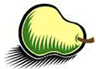

<figure>

<figcaption>BOSC logo</figcaption>
</figure>

This page has links to all the publicly available talk slides, videos
and posters. The videos are all on the [BOSC 2014 YouTube
playlist](https://www.youtube.com/playlist?list=PLir-OOQiOhXYxkgAqov3J8rwTPUxC0soJ),
with thanks to Google for sponsorship.

You can download the [full program with abstracts
(PDF)](http://www.open-bio.org/bosc2014/BOSC2014_program.pdf); however,
this wiki page is considered the definitive schedule and was updated
with any last minute changes.

There was lots of activity under Twitter - our hashtag was \#BOSC2014
and there are Storify Tweet archives for [Day
One](https://storify.com/pjacock/bosc-2014-day-one), [Day
Two](https://storify.com/pjacock/bosc-2014-day-two/) and [during
ISMB](https://storify.com/pjacock/bosc-during-ismb-2014/).

## Pre-BOSC Codefest: July 9-10, 2014

See [ Codefest 2014](Codefest_2014 "wikilink") for details.

## BOSC Day 1: Friday, 11 July 2014

| Time            | Topic                                                                                                                                                                                                                                                                                                                                                                                                                                                                                                                                | Speaker \[Poster\], Moderator, or notes                      |
|-----------------|--------------------------------------------------------------------------------------------------------------------------------------------------------------------------------------------------------------------------------------------------------------------------------------------------------------------------------------------------------------------------------------------------------------------------------------------------------------------------------------------------------------------------------------|--------------------------------------------------------------|
| **7:30-9:00**   | **Registration**                                                                                                                                                                                                                                                                                                                                                                                                                                                                                                                     | Early arrival is recommended as there are usually long lines |
| 9:00-9:15       | Introduction and Welcome                                                                                                                                                                                                                                                                                                                                                                                                                                                                                                             | Nomi Harris and/or Peter Cock (Chairs, BOSC 2014)            |
| 9:15-10:15      | [Keynote: A History of Bioinformatics (in the Year 2039)](BOSC_2014_Keynote_Speakers "wikilink") ([video](https://youtu.be/uwsjwMO-TEA), [slideshare](http://www.slideshare.net/c.titus.brown/2014-bosckeynote), [notes](http://ivory.idyll.org/blog/2014-bosc-keynote.html))                                                                                                                                                                                                                                                        | C. Titus Brown                                               |
| **10:15-10:45** | **Coffee Break**                                                                                                                                                                                                                                                                                                                                                                                                                                                                                                                     |                                                              |
| *10:45-12:30*   | ***Session: Genome-scale Data and Beyond***                                                                                                                                                                                                                                                                                                                                                                                                                                                                                          | Chair: Chris Fields                                          |
| 10:45-11:03     | \[Genome-Scale\] ADAM: Fast, Scalable Genomic Analysis ([video](https://youtu.be/EtAWRuvuwr8), [slides](http://www.open-bio.org/bosc2014/BOSC2014-Genome-01-ADAM-Nothaft.pdf))                                                                                                                                                                                                                                                                                                                                                       | Frank Austin Nothaft \[P1\]                                  |
| 11:03-11:21     | \[Genome-Scale\] A Framework for Benchmarking RNA-seq Pipelines ([video](https://youtu.be/_LTaNFY9IjM), [slides](http://www.open-bio.org/bosc2014/BOSC2014-Genome-02-Rory.pdf))                                                                                                                                                                                                                                                                                                                                                      | Rory Kirchner                                                |
| 11:21-11:39     | \[Genome-Scale\] New Frontiers of Genome Assembly with SPAdes 3.1 ([video](https://youtu.be/vFA7BGzNMss), [slides](http://www.open-bio.org/bosc2014/BOSC2014-Genome-03-SPAdes-Prjibelski.pdf))                                                                                                                                                                                                                                                                                                                                       | Andrey Prjibelski \[P2\]                                     |
| 11:39-11:57     | \[Genome-Scale\] SigSeeker: An Ensemble for Analysis of Epigenetic Data ([video](https://youtu.be/3gTEoyVNA6Q), [slides](http://www.open-bio.org/bosc2014/BOSC2014-Genome-04-SigSeeker-Lichtenberg.pdf))                                                                                                                                                                                                                                                                                                                             | Jens Lichtenberg \[P3\]                                      |
| 11:57-12:15     | \[Genome-Scale\] Galaxy as an Extensible Job Execution Platform ([video](https://youtu.be/XLh_Q4Q0YBE), [slides](https://docs.google.com/presentation/d/1uQmmC2Cl5gpPe9cBwjl0cdKno1tsRKz2XNZg9NOMwdI/edit#slide=id.p))                                                                                                                                                                                                                                                                                                               | John Chilton                                                 |
| 12:15-12:30     | [Open Bioinformatics Foundation (OBF) update](Main_Page "wikilink") ([video](https://youtu.be/1oSTb8ZAxec))                                                                                                                                                                                                                                                                                                                                                                                                                          | Hilmar Lapp (OBF President)                                  |
| **12:30-13:30** | **Lunch**                                                                                                                                                                                                                                                                                                                                                                                                                                                                                                                            | (and poster session)                                         |
| **13:00-14:00** | **Poster Session and Birds of a Feather** (overlapping with lunch)                                                                                                                                                                                                                                                                                                                                                                                                                                                                   | Suggest a BOF topic [here!](BOSC_2014/BOFs "wikilink")       |
| *14:00-15:30*   | ***Session: Visualization***                                                                                                                                                                                                                                                                                                                                                                                                                                                                                                         | Chair: Rob Davey                                             |
| 14:00-14:18     | \[Visualization\] WormGUIDES: an Interactive Informatic Developmental Atlas at Subcellular Resolution ([video](https://youtu.be/uxPnmyGydW4), [slides](http://www.open-bio.org/bosc2014/BOSC2014-Viz-01-WormGUIDES-Santella.pdf))                                                                                                                                                                                                                                                                                                    | Anthony Santella \[P4\]                                      |
| 14:18-14:36     | \[Visualization\] BioJS: an Open Source Standard for Biological Visualisation ([video](https://youtu.be/aHtXNW-I2U0))                                                                                                                                                                                                                                                                                                                                                                                                                | Manuel Corpas \[P5\]                                         |
| 14:36-14:54     | \[Visualization\] Biodalliance: a Fast, Extensible Genome Browser ([video](https://youtu.be/l4Z7wsppCaM))                                                                                                                                                                                                                                                                                                                                                                                                                            | Thomas Down                                                  |
| 14:54-15:12     | \[Visualization\] TGAC Browser: Visualisation Solutions for Big Data in the Genomic Era ([video](https://youtu.be/yKx8lE2WQzI), [slides](http://www.open-bio.org/bosc2014/BOSC2014-Viz-04-TGAC_Browser-Anil.pdf))                                                                                                                                                                                                                                                                                                                    | Anil S. Thanki \[P6\]                                        |
| 15:12-15:30     | \[Visualization\] Explore, Analyze, and Share Genomic Data Using Integrated Genome Browser ([video](https://youtu.be/b7O9rN2i0GM), [slides](http://www.open-bio.org/bosc2014/BOSC2014-Viz-05-IGB-Ann_Loraine.pdf))                                                                                                                                                                                                                                                                                                                   | Ann Loraine                                                  |
| **15:30-16:00** | **Coffee Break**                                                                                                                                                                                                                                                                                                                                                                                                                                                                                                                     |                                                              |
| *16:00-17:00*   | ***Session: Bioinformatics Open Source Project Updates***                                                                                                                                                                                                                                                                                                                                                                                                                                                                            | Chair: Peter Cock                                            |
| 16:00-16:12     | \[Updates\] BioMart 0.9 – Introducing Tools for Data Analysis and Visualisation ([video](https://youtu.be/XJmyC1sfFeg), [slides](http://www.open-bio.org/bosc2014/BOSC2014-Updates-01-BioMart.pdf))                                                                                                                                                                                                                                                                                                                                  | Arek Kasprzyk                                                |
| 16:12-16:24     | \[Updates\] Biocaml: The OCaml Bioinformatics Library ([video](https://youtu.be/0lDWzyhdyP8), [slides](http://www.open-bio.org/bosc2014/BOSC2014-Updates-02-Biocaml-Agarwal.pdf))                                                                                                                                                                                                                                                                                                                                                    | Ashish Agarwal                                               |
| 16:24-16:36     | \[Updates\] BioRuby and Distributed Development ([video](https://youtu.be/tRpxLmu4w3w), [abstract](https://github.com/pjotrp/biogems.info/blob/master/doc/abstracts/BOSC2014_BioRuby_dev.md), [slides](http://www.open-bio.org/bosc2014/BOSC2014-Updates-03-BioRuby-Pjotr.pdf))                                                                                                                                                                                                                                                      | Pjotr Prins                                                  |
| 16:36-16:48     | \[Updates\] Biopython Project Update ([video](https://youtu.be/bJ5OcCYq-G4), [slides](http://www.open-bio.org/bosc2014/BOSC2014-Updates-04-Biopython-Arindrarto.pdf))                                                                                                                                                                                                                                                                                                                                                                | Wibowo Arindrarto                                            |
| 16:48-17:00     | \[Updates\] Shared Bioinformatics Databases Within Unipro UGENE ([video](https://youtu.be/tS57J2JeL-Y), [slides](http://www.open-bio.org/bosc2014/BOSC2014-Updates-05-UGENE-Protsyuk.pdf))                                                                                                                                                                                                                                                                                                                                           | Ivan Protsyuk \[P7\]                                         |
| *17:00-17:30*   | ***Session: Lightning Talks***                                                                                                                                                                                                                                                                                                                                                                                                                                                                                                       | Chair: Peter Cock                                            |
| 17:00-17:05     | \[Lightning\] Fostering the Next Generation of Data-driven Open Science with R ([video](https://youtu.be/p4hbpb3d6v8), [slides](http://karthik.github.io/BOSC/))                                                                                                                                                                                                                                                                                                                                                                     | Karthik Ram                                                  |
| 17:07-17:12     | \[Lightning\] Tripal: an Open Source Toolkit for Building Genomic and Genetic Data Websites and Databases ([video](https://youtu.be/-IUr8Tghvsw), [slides](http://www.open-bio.org/bosc2014/BOSC2014-Lightning-2-Tripal-Staton.pdf))                                                                                                                                                                                                                                                                                                 | Margaret Staton                                              |
| 17:14-17:19     | \[Lightning\] PLUTo: Phyloinformatic Literature Unlocking Tools ([video](https://youtu.be/qX0ocTMc8MY), [slides](http://www.open-bio.org/bosc2014/BOSC2014-Lightning-3-PLUTo-Mounce.pdf))                                                                                                                                                                                                                                                                                                                                            | Ross Mounce                                                  |
| 17:21-17:26     | \[Lightning\] A Publication Model that Aligns with the Key Open Source Software Principles ([video](https://youtu.be/iWQXfyFtRUU), [slides](http://www.open-bio.org/bosc2014/BOSC2014-Lightning-4-F1000-Markie.pdf))                                                                                                                                                                                                                                                                                                                 | Michael L. Markie \[P8\]                                     |
| 17:27-17:30     | Announcements                                                                                                                                                                                                                                                                                                                                                                                                                                                                                                                        | Nomi Harris and/or Peter Cock                                |
| 17:30-18:30     | **[BOFs](BOSC_2014/BOFs "wikilink")**                                                                                                                                                                                                                                                                                                                                                                                                                                                                                                | Suggest a BOF topic [here!](BOSC_2014/BOFs "wikilink")       |
| 19:00           | *Pay-your-own-way Friday BOSC dinner* (FULL) [The Asgard Irish Pub and Restaurant](http://www.classicirish.com/asgard-home.php), [350 Massachusetts Avenue, Cambridge, MA](https://maps.google.com/maps?ll=42.352697,-71.0733475&z=15&geocode=FXAthgId4UjD-ylJGc0sBXrjiTEgso4wQw9wIA;FT1nhgId6RvD-yn13UfwVHfjiTESJTW6VTsm6Q&saddr=Hynes+Convention+Center+Station&daddr=The+Asgard+Irish+Pub+and+Restaurant,+350+Massachusetts+Ave,+Cambridge,+MA+02139&dirflg=r&output=classic&dg=ntvb) (1.2 miles north of the convention center). | Only those who have already RSVPed will be admitted.         |
|                 |                                                                                                                                                                                                                                                                                                                                                                                                                                                                                                                                      |                                                              |

  

## BOSC Day 2: Saturday, 12 July 2014

| Time            | Topic                                                                                                                                                                                                                                                                                         | Speaker or Moderator                                                                                             |
|-----------------|-----------------------------------------------------------------------------------------------------------------------------------------------------------------------------------------------------------------------------------------------------------------------------------------------|------------------------------------------------------------------------------------------------------------------|
| 8:55-9:00       | Announcements                                                                                                                                                                                                                                                                                 | Peter Cock and/or Nomi Harris (Chairs, BOSC 2014)                                                                |
| 9:00-9:15       | [ Codefest 2014 Report](Codefest_2014 "wikilink") ([video](https://youtu.be/EuWgm6V9DgI), [slides](https://docs.google.com/presentation/d/114yvrK0Veasc_ns_rg484j2xxRi1h7wNlU2XKONuUqY/edit?usp=sharing))                                                                                     | Brad Chapman                                                                                                     |
| 9:15-10:15      | \| [Keynote: Biomedical Research as an Open Digital Enterprise](BOSC_2014_Keynote_Speakers "wikilink") ([video](https://youtu.be/VmRNkdHKJgA), [slidesshare](http://www.slideshare.net/pebourne/bosc2014))                                                                                    | Philip Bourne                                                                                                    |
| **10:15-10:45** | **Coffee Break**                                                                                                                                                                                                                                                                              |                                                                                                                  |
| *10:45-12:30*   | ***Session: Software Interoperability***                                                                                                                                                                                                                                                      | Chair: Raoul Bonnal                                                                                              |
| 10:45-11:03     | \[Interoperability\] Pathview: an R/Bioconductor Package for Pathway-based Data Integration and Visualization ([video](https://youtu.be/sne_Nb9au20), [slides](http://www.open-bio.org/bosc2014/BOSC2014-InterOp-01-Pathview-Weijun.pdf))                                                     | Weijun Luo \[P9\]                                                                                                |
| 11:03-11:21     | \[Interoperability\] Use of Semantically Annotated Resources in the Mobyle2 Web Framework ([video](https://youtu.be/5sYUuoXOBiE), [slides](http://www.open-bio.org/bosc2014/BOSC2014-InterOp-02-Mobyle2_EDAM-Ménager.pdf))                                                                    | Hervé Ménager                                                                                                    |
| 11:21-11:39     | \[Interoperability\] Towards Ubiquitous OWL Computing: Simplifying Programmatic Authoring of and Querying with OWL Axioms ([video](https://youtu.be/K0SlYwMyn-A), [slides](http://www.open-bio.org/bosc2014/BOSC2014-InterOp-03-Ubiquitous_OWL-Hilmar.pdf))                                   | Hilmar Lapp                                                                                                      |
| 11:39-11:57     | \[Interoperability\] Integrating Taverna Player into Scratchpads ([video](https://youtu.be/iL-rMaFtYdM), [slideshare](http://www.slideshare.net/roberthaines/tp-scratchtalk-36957762), [poster](https://zenodo.org/record/10871))                                                             | Robert Haines \[P10\]                                                                                            |
| 11:57-12:15     | \[Interoperability\] Small Tools for Bioinformatics ([video](http://youtu.be/8jHbvClB1i8), [slides](http://www.open-bio.org/bosc2014/BOSC2014-InterOp-05-small_tools_Pjotr.pdf), [abstract](https://github.com/pjotrp/bioinformatics), [manifesto](https://github.com/pjotrp/bioinformatics)) | Pjotr Prins                                                                                                      |
| **12:30-13:30** | **Lunch**                                                                                                                                                                                                                                                                                     | (and poster session)                                                                                             |
| **13:00-14:00** | **Poster Session and Birds of a Feather** (overlapping with lunch)                                                                                                                                                                                                                            | Suggest a BOF topic [here!](BOSC_2014/BOFs "wikilink")                                                           |
| *14:00-15:30*   | ***Session: Open Science and Reproducible Research***                                                                                                                                                                                                                                         | Chair: Hilmar Lapp                                                                                               |
| 14:00-14:18     | \[Open Science\] SEEK for Science: A Data Management Platform which Supports Open and Reproducible Science ([video](https://youtu.be/g8b98kJwT60), [slideshare](http://www.slideshare.net/carolegoble/bosc-seek2014goble))                                                                    | Carole Goble \[P11\]                                                                                             |
| 14:18-14:36     | \[Open Science\] Arvados: Achieving Computational Reproducibility and Data Provenance in Large-Scale Genomic Analyses ([video](https://youtu.be/ZFAaJfzwxW4), [slides](http://www.open-bio.org/bosc2014/BOSC2014-OpenScience-02-Arvados-Brett_Smith.pdf))                                     | Brett Smith                                                                                                      |
| 14:36-14:54     | \[Open Science\] Enhancing the Galaxy Experience through Community Involvement ([video](https://youtu.be/z-Z1cuOO4ts), [slides](http://www.open-bio.org/bosc2014/BOSC2014-OpenScience-03-Galaxy-Blankenberg.pdf))                                                                             | Daniel Blankenberg                                                                                               |
| 14:54-15:12     | \[Open Science\] Supporting Dynamic Community Developed Biological Pipelines ([slides](https://github.com/chapmanb/bcbb/blob/master/talks/bosc2014_bcbio/chapman_bcbio.pdf?raw=true))                                                                                                         | Brad Chapman                                                                                                     |
| 15:12-15:30     | \[Open Science\] 'Open' as a Strategy for Durability, Reproducibility and Scalability ([video](https://youtu.be/TMzWRQUbO4U), [slides](http://www.open-bio.org/bosc2014/BOSC2014-OpenScience-05-Open_as_a_strategy-Rees.pdf))                                                                 | Jonathan Rees                                                                                                    |
| **15:30-16:00** | **Coffee Break**                                                                                                                                                                                                                                                                              |                                                                                                                  |
| 16:00-17:00     | **Panel**: Reproducibility: Rewards and Challenges ([video](https://youtu.be/65Rx89eZWpU))                                                                                                                                                                                                    | Moderator: Brad Chapman; Panelists: Phil Bourne, Titus Brown, Varsha Khodiyar, Kaitlin Thaney                    |
| 17:00-17:10     | Presentation of Student Travel Awards & Concluding Remarks                                                                                                                                                                                                                                    | Nomi Harris (Co-Chair, BOSC 2014)                                                                                |
| 17:10-18:00     | [BOFs](BOSC_2014/BOFs "wikilink")                                                                                                                                                                                                                                                             | Suggest a BOF topic [here!](BOSC_2014/BOFs "wikilink")                                                           |
| 19:00           | Pay-your-own-way BOSC Saturday dinner: [Summer Shack](http://www.summershackrestaurant.com/locations/boston/), 50 Dalton St., Boston                                                                                                                                                          | Dinner now FULL. If you RSVPed yes but can't attend, please [edit your RSVP](http://doodle.com/iqhmez2rz57trazg) |
|                 |                                                                                                                                                                                                                                                                                               |                                                                                                                  |

Note: the ISMB reception starts at 17:30...

------------------------------------------------------------------------

### Posters

If the speaker also gave a talk, any poster link will be above (posters
1 to 11). This table lists poster-only presentations.

| Poster | Title                                                                                                                                                                                                                                              | Presenter                               |
|--------|----------------------------------------------------------------------------------------------------------------------------------------------------------------------------------------------------------------------------------------------------|-----------------------------------------|
| P12    | Advantages and challenges of using the Galaxy API within an integrated data analysis and visualization platform                                                                                                                                    | Ilya Sytchev                            |
| P13    | Connecting computational steps for NGS, and beyond. ([source code](https://github.com/Novartis/railroadtracks))                                                                                                                                    | Laurent Gautier                         |
| P14    | Updates to MISO, the open-source NGS LIMS project                                                                                                                                                                                                  | Xingdong Bian                           |
| P15    | Running Taverna Workflows within IPython Notebook                                                                                                                                                                                                  | Alan Williams / Aleksandra Pawlik (TBC) |
| P16    | Reconstruction of ancestral genomes in presence of gene gain and loss                                                                                                                                                                              | Shuai Jiang                             |
| P17    | *Withdrawn*                                                                                                                                                                                                                                        | *Withdrawn*                             |
| P18    | GEPETTO Update: An Open Source Framework for Gene Prioritization                                                                                                                                                                                   | Hoan Nguyen                             |
| P19    | NeoPipe: An Open Source Framework for Protein sequence analysis                                                                                                                                                                                    | Hoan Nguyen                             |
| P20    | MyGene.info updates: scalable gene-centric web services with user contributions                                                                                                                                                                    | Chunlei Wu                              |
| P21    | Aiding the journey from data to publication in the plant sciences                                                                                                                                                                                  | Robert Davey                            |
| P22    | Bio2RDF mobile: an app for biological semantic web databases                                                                                                                                                                                       | Maxime Déraspe                          |
| P24    | BioBuilds: A Model for Long Term Sustainability of Open Source Bioinformatics                                                                                                                                                                      | Chris Mueller                           |
| P25    | GigaGalaxy: A GigaSolution for reproducible and sustainable genomic data publication and analysis ([poster](http://figshare.com/articles/GigaGalaxy_A_GigaSolution_for_reproducible_and_sustainable_genomic_data_publication_and_analysis/713512)) | Scott Edmunds                           |
|        |                                                                                                                                                                                                                                                    |                                         |

------------------------------------------------------------------------

<table>
<tbody>
<tr class="odd">
<td rowspan="2"><figure>

<figcaption>Eagle Genomics logo</figcaption>
</figure></td>
<td rowspan="2">
            
</td>
<td rowspan="2"><figure>

<figcaption>GigaScience</figcaption>
</figure></td>
<td rowspan="2">
        
</td>
<td><figure>

<figcaption>Curoverse logo</figcaption>
</figure></td>
</tr>
<tr class="even">
<td><figure>

<figcaption>Arvados logo</figcaption>
</figure></td>
</tr>
</tbody>
</table>

We thank [Eagle Genomics](http://www.eaglegenomics.com/) for sponsoring
the BOSC Student Travel Awards again this year, and welcome the open
access journal [GigaScience](http://www.gigasciencejournal.com/), and
[Curoverse](http://curoverse.com) (the team behind the open source
platform [Arvados](http://arvados.org)) as new sponsors for BOSC 2014.

We are grateful to [Google](http://www.google.com/) for their generous
support for videorecording BOSC 2014.

------------------------------------------------------------------------

## Return to **[ BOSC 2014](BOSC_2014 "wikilink")** main page
