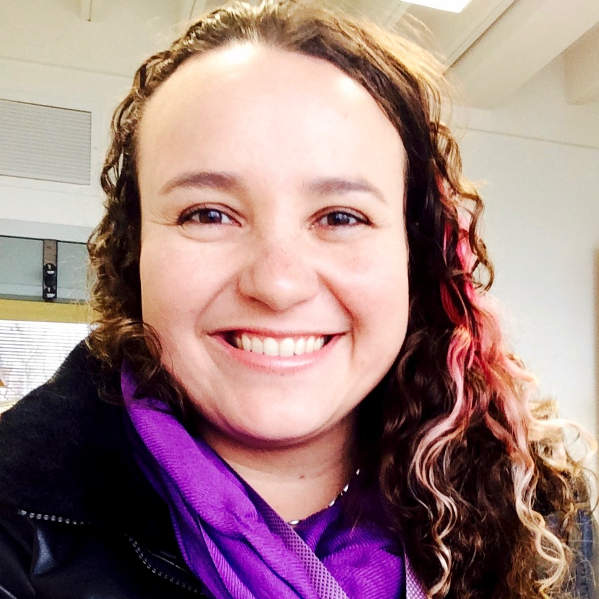
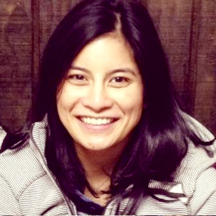
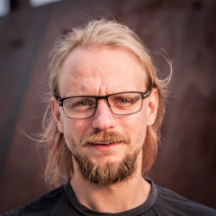
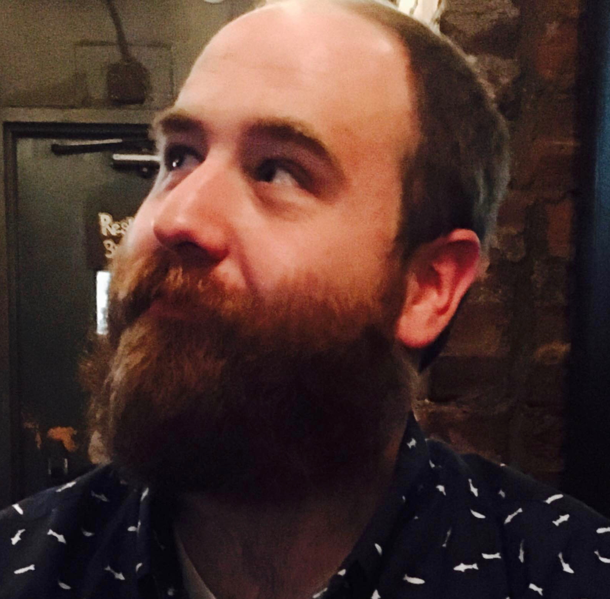
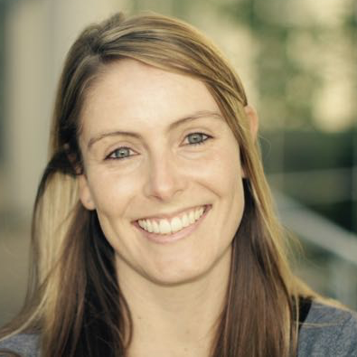

<figure>

<figcaption>BOSC logo</figcaption>
</figure>

## Growing and sustaining open source communities

Every year, BOSC includes a panel discussion that offers attendees the
chance to engage in conversation with the panelists and each other. This
year, our panel discussion will focus on how to grow and sustain open
source communities, new or old, with different topics, goals,
organizational structures and funding models.

<table>
<tbody>
<tr class="odd">
<td><figure>

<figcaption>Mónica Muñoz-Torres</figcaption>
</figure></td>
<td>
Panel chair <strong>Mónica Muñoz-Torres</strong> (<a
href="https://twitter.com/monimunozto">@monimunozto</a>) is the
biocuration lead for Berkeley Bioinformatics Open-Source Projects (BBOP)
at Lawrence Berkeley National Laboratory. She is part of the development
teams for Apollo (a web-based annotation editor designed to support
community-based curation of genomes) and the tools of the Gene Ontology
(GO) Consortium. She leads the Community Curation group within the
global initiative to sequence and annotate the genomes of 5,000
arthropods (i5K Initiative), and is a member of the Executive Committee
of the International Society for Biocuration (ISB). As a graduate
student, Monica founded the first Southeastern Chapter of the Society
for Advancement of Hispanics/Chicanos and Native Americans in Science
(SACNAS) at Clemson University; the chapter has since been actively
involved in outreach activities to local high schools in an attempt to
inspire students to pursue careers in STEM.
</td>
</tr>
<tr class="even">
<td><figure>

<figcaption>Abigail Cabunoc Mayes</figcaption>
</figure></td>
<td>
<strong>Abigail Cabunoc Mayes</strong> (<a
href="https://twitter.com/abbycabs">@abbycabs</a>) is the Lead Developer
of the <a href="https://mozillascience.org/">Mozilla Science Lab</a>, an
initiative of the Mozilla Foundation working to make research
collaborative, accessible and usable. She has led development on various
open source science projects such as <a
href="https://badges.mozillascience.org/">Contributorship Badges for
Science</a> and WormBase. Before joining Mozilla, Abby worked as a
bioinformatics software developer at the Ontario Institute for Cancer
Research and at Michigan State University. With a background in
bioinformatics and computer science, she builds tools that use the web
to move science forward.
</td>
</tr>
<tr class="odd">
<td><figure>

<figcaption>Bastian Greshake</figcaption>
</figure></td>
<td>
<strong>Bastian Greshake</strong> (<a
href="https://twitter.com/gedankenstuecke">@gedankenstuecke</a>) is a
biologist-turned-bioinformatician, currently working on his PhD in the
Group for Applied Bioinformatics at the University of Frankfurt. When
not doing research in fungal genomics he's also an open* advocate. In
2011 he co-founded openSNP, a crowdsourced/citizen science open data
project that puts personal genetics data into the public domain. Over
the course of running openSNP he experienced the different sides of
sustaining and growing a scientific open source project which is
independent of traditional academic institutions.
</td>
</tr>
<tr class="even">
<td><figure>

<figcaption>Jamie Whitacre</figcaption>
</figure></td>
<td>
<strong>Jamie Whitacre</strong> is the technical project manager
for Project Jupyter, which was born out of the IPython Notebook in 2014.
Jupyter is a web application that allows users to perform exploratory
data analysis and create and share documents that contain live code,
equations, visualizations and explanatory text. Before joining Project
Jupyter, Jamie worked with the Smithsonian’s National Museum of Natural
History building out scientific workflows and databases for several
genetics and genomics initiatives. Jamie works from the Berkeley
Institute for Data Science and is an affiliate of the Lawrence Berkeley
National Laboratory.
</td>
</tr>
<tr class="odd">
<td><figure>

<figcaption>John Chilton</figcaption>
</figure></td>
<td>
<strong>John Chilton</strong> (<a
href="https://twitter.com/jmchilton">@jmchilton</a>) is a software
developer on the <a href="https://galaxyproject.org/">Galaxy project</a>
working at Penn State in the lab of Anton Nekrutenko. He has loudly
pushed the Galaxy community toward increased openness by spearheading
efforts such as the adoption of an <a
href="https://github.com/galaxyproject/galaxy/pull/314">open governance
model</a> and a project <a
href="https://github.com/galaxyproject/galaxy/blob/dev/CODE_OF_CONDUCT.md">code
of conduct</a>. He is also one of the co-founders of the <a
href="http://www.commonwl.org/">Common Workflow Language</a>.
</td>
</tr>
<tr class="even">
<td><figure>

<figcaption>Natasha Wood</figcaption>
</figure></td>
<td>
<strong>Natasha Wood</strong> (<a
href="https://twitter.com/natasha_wood">@natasha_wood</a>) is an NRF
Research Career Award Fellow and lecturer in the Department of
Integrative Biomedical Sciences at the University of Cape Town, South
Africa. Her research includes molecular dynamics and evolutionary
modelling of HIV structural and sequence data to better understand the
interplay between the virus and host immune system. She promotes the
development of the bioinformatics community through training
initiatives, hackathons and more social platforms (as co-founder of the
Cape Unseminars in Bioinformatics).
</td>
</tr>
</tbody>
</table>

------------------------------------------------------------------------

## Return to [BOSC 2016](BOSC_2016 "wikilink") main page
