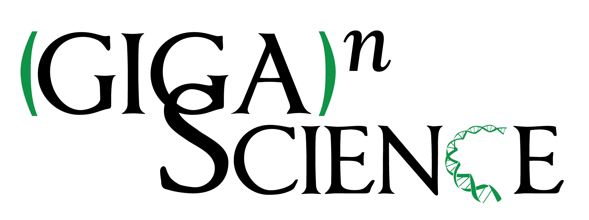

 The 18th Annual
Bioinformatics Open Source Conference (BOSC 2017) was held **July 22-23,
2017 in Prague** as part of the [ISMB/ECCB
meeting](https://www.iscb.org/ismbeccb2017).

### Check out the [BOSC 2017 Schedule](BOSC_2017_Schedule "wikilink"), including [self-organizing Birds-of-a-feather groups (BOFs)!](https://docs.google.com/document/d/1pCkjxooRxHhh3mcqxy7h083mUxt2Ldh1N0kJRwNdjx8/edit)

For 2018, we are trying something different and holding [BOSC
2018](BOSC_2018 "wikilink") along with the Galaxy Community Conference
in a new unified event ([GCC BOSC
2018](https://gccbosc2018.sched.com/)), which will take place in
Portland, Oregon, June 25-30.

## Overview

The Bioinformatics Open Source Conference (BOSC) is organized by the
[Open Bioinformatics Foundation
(OBF)](https://www.open-bio.org/wiki/Main_Page), a non-profit group
dedicated to promoting the practice and philosophy of open source
software development and open science within the biological research
community. Since its inception in 2000, BOSC has provided a forum for
developers and users to interact and share research results and ideas in
open source bioinformatics. BOSC’s broad spectrum of topics includes
practical techniques for solving bioinformatics problems; software
development practices; standards and ontologies; approaches that promote
open science and sharing of data, results and software; and ways to grow
open source communities while promoting diversity within them.

We also organize a [Codefest](Codefest "wikilink"), a two-day community
development session, usually just before or after BOSC. This is an
opportunity for anyone interested in open science, biology and
programming to meet, discuss and work collaboratively. Everyone is
welcome to attend [Codefest 2017](Codefest_2017 "wikilink") (whether or
not you attend BOSC).

Please spread the word about BOSC--all are welcome. On Twitter, [follow
@OBF_BOSC](https://twitter.com/OBF_BOSC) and use [hash tag
\#bosc2017](https://twitter.com/search?q=%23BOSC2017).

## Summaries of BOSC 2017

There were lots of [tweets about
\#BOSC2017](https://twitter.com/search?f=tweets&vertical=default&q=%23BOSC2017)
by participants, and a number of blog posts, including:

- Peter Cock's Storify of BOSC tweets: [Day
  1](https://storify.com/pjacock/bosc-2017-day-one), [Day
  2](https://storify.com/pjacock/bosc-2017-day-two)
- [@yoyehudi](https://twitter.com/yoyehudi)'s writeups. republished by
  PLOS Comp Biol Field Reports: [Day
  1](https://medium.com/plos-comp-biol-field-reports-2016/bosc-2017-day-1-fbe73f01de2e),
  [Day 2 (Part
  1)](https://medium.com/plos-comp-biol-field-reports-2016/bosc-2017-day-2-part-1-bosc2017-ismbeccb-9d4d8fda000c),
  [Day 2 (Part
  2)](https://medium.com/plos-comp-biol-field-reports-2016/bosc-2017-day-2-part-2-bosc2017-ismbeccb-af4bf4a63a84),
  [Day 2 (part
  3)](https://medium.com/@yoyehudi/bosc-2017-day-2-part-3-keynote-bosc2017-ismbeccb-5a1598be50c4)
- Brad Chapman's summaries (on GitHub, so if you disagree with him, you
  can submit pull requests): [Day 1
  (morning)](https://github.com/chapmanb/bcbb/blob/master/posts/conferences/bosc2017_day1a.md),
  [Day 1
  (afternoon)](https://github.com/chapmanb/bcbb/blob/master/posts/conferences/bosc2017_day1b.md),
  [Day 2
  (morning)](https://github.com/chapmanb/bcbb/blob/master/posts/conferences/bosc2017_day2a.md)
- Recap by Jonathan Sobel (of [BeerDeCoded](http://www.genome.beer/)
  fame): [Jonathan's
  report](https://jonathansobel1.wordpress.com/2017/07/27/bosc-session-of-the-eccbismb-2017/).
  (Jonathan received an [OBF Travel
  Fellowship](https://github.com/OBF/obf-docs/blob/master/Travel_fellowships.md))
- Robin Andeer's [Codefest and BOSC 2017 blog
  post](http://www.robinandeer.com/blog/2017/07/24/Codefest-and-BOSC-2017/)
- Bérénice Batut's
  [photos](https://www.flickr.com/photos/134305289@N03/35287392054/in/album-72157684042963763/)
- Neil Saunders' [BOSC2017 Twitter
  analysis](https://nsaunders.wordpress.com/2017/07/25/twitter-coverage-of-the-bioinformatics-open-source-conference-2017/)
  and [ISMB/ECCB 2017 Twitter
  analysis](https://nsaunders.wordpress.com/2017/08/02/twitter-coverage-of-the-ismbeccb-conference-2017/)

## Important Dates

- April 13, 2017: Deadline for [submitting
  abstracts](BOSC_Abstract_Submission "wikilink") for full talks
- June 5, 2017: Deadline for submitting abstracts for late-breaking
  lightning talks and/or late posters (no walk-in posters accepted this
  year)
- July 20-21, 2017: [Codefest 2017](Codefest_2017 "wikilink"), [Brmlab,
  Prague](https://brmlab.cz/) (a non-profit, community-run hackerspace)
- July 21-25: Combined [ISMB/ECCB
  meeting](https://www.iscb.org/ismbeccb2017)
- **July 22-23, 2017: BOSC 2017, Prague**

## Session Topics

BOSC covers all aspects of bioinformatics and open science software,
including (but not limited to):

- Open Science and Reproducible Research
- Open Biomedical Data
- Citizen/Participatory Science
- Standards and Interoperability
- Data Science
- Workflows
- Visualization
- Medical and Translational Bioinformatics
- Developer Tools and Libraries
- Bioinformatics Open Source Project Progress Reports
- [PANEL: Open Data--Standards, Opportunities and
  Challenges](BOSC_2017_Panel "wikilink")

## Keynote Speakers

This year's keynote speakers will be Nick Loman (University of
Birmingham), a vocal proponent of open genomic data in healthcare who
heads the Zibra project, and Madeleine Ball (Open Humans), who is
dedicated to opening human health data.

**[More information about BOSC 2017 Keynote
Speakers](BOSC_2017_Keynote_Speakers "wikilink")**

## Registration

To attend BOSC 2017, you need to register for [ISMB/ECCB
2017](https://www.iscb.org/ismbeccb2017-registration). You can register
for the full meeting (July 21-25) or just the first two full days (July
22-23).

In the past, BOSC has taken place the two days before ISMB as a Special
Interest Group (SIG). This year, ISMB is trying a new structure: the
SIGs (now called Communities of Special Interest, or COSIs) are
integrated into the main ISMB meeting. BOSC will take place the first
two full days of ISMB (July 22-23). BOSC attendees can register for the
full ISMB/ECCB meeting (July 21-25) or for just two days (there is no
single-day registration option this year). Note that the pricing
structure is designed to encourage participants to join ISCB, as this
saves you money overall.

If you choose the July 22-23 option, this includes the opening ISMB
reception and keynote the evening of July 21. As in past years, you will
be able to move freely between all of the COSIs that take place during
the days for which you register.

## Sponsors

BOSC is organised by the [Open Bioinformatics
Foundation](Main_Page "wikilink"), a non-profit, volunteer-run group
dedicated to promoting the practice and philosophy of Open Source
software development and Open Science within the biological research
community.

<table>
<tbody>
<tr class="odd">
<td>

</td>
<td>
   
</td>
<td>

</td>
<td>
   
</td>
<td>

</td>
</tr>
</tbody>
</table>

<table>
<tbody>
<tr class="odd">
<td>
   
</td>
<td>

</td>
<td>
   
</td>
<td>

</td>
<td>
   
</td>
<td>

</td>
</tr>
</tbody>
</table>

We are grateful to and welcome [The Hyve](http://thehyve.nl/) (open
source solutions for bioinformatics), [Mozilla Science
Lab](https://science.mozilla.org/) (a community of researchers,
developers, and librarians making research open and accessible),
[Repositive Limited](https://repositive.io/) (connecting the genomics
community with the data they need), [Seven
Bridges](https://www.sevenbridges.com/) (the Biomedical Data Analysis
Platform) and [eLife](https://elifesciences.org/labs) (cutting-edge
technology for cutting-edge research) as new sponsors for BOSC 2017, and
[GigaScience](http://gigasciencejournal.com) (an open access, open data,
open peer-review journal) as a returning sponsor.

If you would like to be a sponsor of BOSC, please contact us at
bosc@open-bio.org.

## Organizing Committee

**Chair**

- Nomi L. Harris (Lawrence Berkeley National Laboratory)

**Co-Chair**

- Heather Wiencko ([Hosted Graphite](https://www.hostedgraphite.com),
  Dublin Ireland)

**Organizing Committee Members**

- Karsten Hokamp (Smurfit Institute of Genetics, Trinity College Dublin,
  Ireland)
- [Brad Chapman](http://bcbio.wordpress.com) ([Biopython
  developer](http://biopython.org); [Harvard School of Public
  Health](http://compbio.sph.harvard.edu/chb/))
- [Peter Cock](http://www.scri.ac.uk/staff/petercock) ([Biopython
  developer](http://biopython.org); [James Hutton
  Institute](http://www.hutton.ac.uk))
- Christopher Fields (National Center for Supercomputing Applications)
- Bastian Greshake (OpenSNP)
- [Hilmar Lapp](http://www.bioperl.org/wiki/Hilmar_Lapp) (Center for
  Genomic and Computational Biology (GCB), Duke University)
- [Mónica
  Muñoz-Torres](http://berkeleybop.org/people/monica-munoz-torres/)
  ([Berkeley Bioinformatics Open Source
  Projects](http://berkeleybop.org/))

## Review Committee

Kai Blin\*, Christian Brueffer\*, Scott Cain\*, Jacqueline Campbell,
Brad Chapman\*, John Chilton, Peter Cock\*, Karen Cranston, Anamaria
Crisan, Michael Crusoe, Philip Ewels, Christopher Fields\*, Konrad
Förstner\*, George Githinji, Bastian Greshake\*, Björn Grüning, Nomi
Harris\*, Michael Heuer\*, Karsten Hokamp\*, Hans-Rudolf Hotz\*, Shaun
Jackman, Hilmar Lapp, Jessica Maia, Scott Markel\*, Hervé Ménager,
Monica Munoz-Torres, Frank Nothaft, Konstantin Okonechnikov, Kieran
O'Neill\*, Lorena Pantano\*, Michael Reich, Surya Saha\*, Gianluca Della
Vedova\*, Heather Wiencko\*, Jason Williams

∗ Also reviewed Late-Breaking Lightning Talk abstracts

## Previous BOSCs

- BOSC has been held yearly since 2000.
- [BOSC 2016](BOSC_2016 "wikilink") took place July 8-9, 2016 in
  Orlando, Florida, right before ISMB 2016.
  - Check out the complete [schedule](BOSC_2016_Schedule "wikilink")
    with links to slides, posters and videos - mostly on our [F1000
    Research BOSC Channel](http://f1000research.com/channels/BOSC), with
    the videos on the [BOSC
    YouTube](https://www.youtube.com/playlist?list=PLir-OOQiOhXbENjAIFF-JZ0WodnysPqfh).
  - Read the [BOSC 2016 Summary
    Report](https://f1000research.com/articles/5-2464/v1), also on
    F1000.

<!-- -->

- [ Information about the first 17 BOSC
  conferences](Past_BOSC_conferences "wikilink")

## Contact Us

- [Follow BOSC on Twitter](https://twitter.com/OBF_BOSC): @OBF_BOSC,
  \#bosc2017
- If you'd like to join the mailing list for BOSC-related announcements,
  including the call for abstracts and deadline reminders, please
  subscribe to
  [bosc-announce](http://lists.open-bio.org/mailman/listinfo/bosc-announce).
  This list has low traffic, and your address will be kept private.
- If you have questions about the conference, or would like to volunteer
  to help out, please contact the organizers at <bosc@open-bio.org>.

## ISMB Code of Conduct

In March 2015, ISMB published a [Code of
Conduct](http://www.iscb.org/ismbeccb2015-general-info/ismbeccb2015-coc)
that applies to SIGs (including BOSC) as well as the main ISMB/ECCB
meeting.
