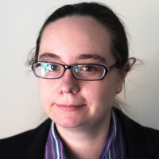
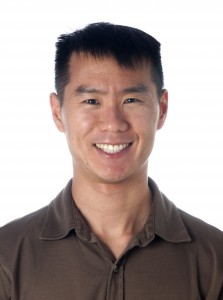
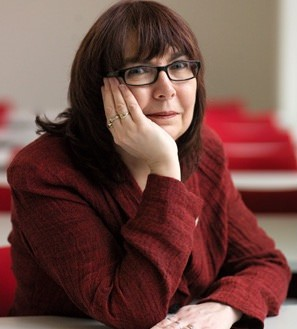

## Open Data: Standards, Opportunities and Challenges

Every year, BOSC includes a panel discussion that offers attendees the
chance to engage in conversation with the panelists and each other. This
year, our panel discussion will focus on open data: how it can help to
catalyze scientific and preserve knowledge, standards for sharing data,
and some of the challenges (for example, protecting privacy of human
health data).

<table>
<tbody>
<tr class="odd">
<td>

</td>
<td>
Panel chair <strong>Mónica Muñoz-Torres</strong> (<a
href="https://twitter.com/monimunozto">@monimunozto</a>) is the
biocuration lead for Berkeley Bioinformatics Open-Source Projects (BBOP)
at Lawrence Berkeley National Laboratory. She leads the Community
Curation group within the global initiative to sequence and annotate the
genomes of 5,000 arthropods (i5K Initiative) and is the chair of the
International Society for Biocuration (ISB).
</td>
</tr>
<tr class="even">
<td>

</td>
<td>
<strong><a href="http://lab.loman.net/about/">Nick
Loman</a></strong> (<a
href="https://twitter.com/pathogenomenick">@pathogenomenick</a>) is
known as a vocal proponent of open genomic data in healthcare. A
Professor of Microbial Genomics and Bioinformatics at the University of
Birmingham, Dr. Loman explores the use of cutting-edge genomics and
metagenomics approaches to human pathogens. He promotes the use of open
data to facilitate the surveillance and treatment of infectious
disease.
</td>
</tr>
<tr class="odd">
<td>

</td>
<td>
<strong>Madeleine Ball</strong> is the Executive Director and
co-founder of Open Humans, an organization dedicated to enabling
individuals to access their data and share it with research studies. She
is also PI of the Open Humans Public Data Sharing study. In recognition
of her vision for opening human health data, Madeleine was recently
awarded a Shuttleworth Foundation Fellowship.
</td>
</tr>
<tr class="even">
<td>

</td>
<td>
<strong>Andrew Su</strong> (<a
href="https://twitter.com/andrewsu">@andrewsu</a>) is Professor at the
Scripps Research Institute in the Department of Integrative, Structural
and Computational Biology. His research focuses on building and applying
bioinformatics infrastructure for biomedical discovery, with a
particular emphasis on leveraging crowdsourcing for genetics and
genomics. His projects include the Gene Wiki, BioGPS, MyGene.Info, and
Mark2Cure, each of which engages “the crowd” to help organize biomedical
knowledge.
</td>
</tr>
<tr class="odd">
<td>

</td>
<td>
<strong>Carole Goble</strong> is a full professor in the School
of Computer Science at the University of Manchester, UK, where she leads
an eScience group of Research Software Engineers and researchers. She is
known for her work on semantic technologies, metadata, ontologies,
workflow management systems, Virtual Research Environments, Research
Objects and new ways of scholarly communication. She leads the
development of a bunch of pioneering software including Apache Taverna
Workflow Manager, myExperiment workflow sharing platform and the
FAIRDOM-SEEK asset management platform for Systems Biology. She is a
leading member of the ELIXIR EU Research Infrastructure for Life Science
Data Management as Head of Node for the UK, co-lead of the
Interoperability Platform and godmother of Bioschemas.org. She is the
coordinator of the FAIRDOM initiative which is part of the EU Research
Infrastructure for Systems Biology (ISBE) and co-founded the UK's
Software Sustainability Institute. She also serves on the Council of the
UK's Biotechnology and Biological Sciences Research Council
(BBSRC).
</td>
</tr>
</tbody>
</table>

------------------------------------------------------------------------

## Return to [BOSC 2017](BOSC_2017 "wikilink") main page
