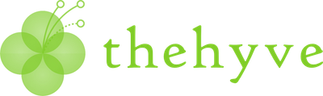

<figure>

<figcaption>BOSC logo</figcaption>
</figure>

## Complete Program

This page has links to all the publicly available talk slides, videos
and posters. Most of the slides and posters are on our [BOSC F1000
Research Collection](http://f1000research.com/collections/BOSC) (others
are on SlideShare and FigShare), while the videos are on the [BOSC 2017
YouTube
playlist](https://www.youtube.com/watch?v=tV6hAWreTSY&list=PLir-OOQiOhXZX_2zmUJz0fx8RLALi3tkK).

- [Download the complete program (including all talk and poster
  abstracts) as a
  PDF](https://www.open-bio.org/w/images/4/42/BOSC2017-complete-program-compressed.pdf)

<!-- -->

- [ISMB/ECCB schedule for BOSC, including brief descriptions of each
  talk
  topic](https://www.iscb.org/cms_addon/conferences/ismbeccb2017/bosc.php)

## Pre-BOSC: Codefest 2017

[Codefest 2017](Codefest_2017 "wikilink") (a pre-BOSC hackathon) will
take place July 20-21 at [Brmlab, Prague](https://brmlab.cz/) (a
non-profit, community-run hackerspace). Codefest is FREE and open to all
(even if you're not attending BOSC). See [Codefest
2017](Codefest_2017 "wikilink") for details and to sign up.

## Schedule at a glance

<table border="0">

<tr>
<td style="width: 50%; vertical-align: top;">
<table border="1" cellspacing="0" cellpadding="7">
<tr>
<td style="background:#D0F781" colspan="2"> <b>Day 1 (Saturday, July 22)</b>
</td></tr>
<tr>
<td> <b>Time</b> </td>
<td> <b>Session</b>
</td></tr>
<tr>
<td> 8:30-9:30 </td>
<td> (ISMB announcements &amp; ISMB keynote)
</td></tr>
<tr>
<td> 10:00-10:10 </td>
<td> BOSC announcements
</td></tr>
<tr>
<td> 10:10-10:45 </td>
<td> Introduction to the Open Bioinformatics Foundation; OBF in the Google Summer of Code; Codefest 2017 Report
</td></tr>
<tr>
<td> 10:45-12:20 </td>
<td> Session: Workflows
</td></tr>
<tr>
<td> 12:30-14:00 </td>
<td> Lunch, Posters, <a rel="nofollow" class="external text" href="https://docs.google.com/document/d/1pCkjxooRxHhh3mcqxy7h083mUxt2Ldh1N0kJRwNdjx8/edit?usp=sharing">Birds of a Feather discussions (BoFs)</a>
</td></tr>
<tr>
<td> 14:00-15:00 </td>
<td> Session: Developer tools and libraries for open science and reproducibility
</td></tr>
<tr>
<td> 15:00-16:00 </td>
<td>  Session: Data Science &amp; Visualization
</td></tr>
<tr>
<td> 16:30-17:30 </td>
<td> <a href="/wiki/BOSC_2017_Keynote_Speakers" title="BOSC 2017 Keynote Speakers"> Keynote: Madeleine Ball</a>
</td></tr>
<tr>
<td> 17:30-18:30 </td>
<td> <a rel="nofollow" class="external text" href="https://docs.google.com/document/d/1pCkjxooRxHhh3mcqxy7h083mUxt2Ldh1N0kJRwNdjx8/edit?usp=sharing">Birds of a Feather discussions (BoFs)</a>
</td></tr>
<tr>
<td> 18:00-19:00 </td>
<td> <a rel="nofollow" class="external text" href="https://www.iscb.org/cms_addon/conferences/ismbeccb2017/posterlist.php?cat=B">Posters</a>
</td></tr></table>
</td>
<td style="border: none">
</td>
<td style="width: 49%; vertical-align: top;">
<table border="1" cellspacing="0" cellpadding="7">
<tr>
<td style="background:#FFFF80;" colspan="2"> <b>Day 2 (Sunday, July 23)</b>
</td></tr>
<tr>
<td> <b>Time</b> </td>
<td> <b>Session</b>
</td></tr>
<tr>
<td> 8:30-9:30 </td>
<td> (ISMB announcements &amp; ISMB keynote)
</td></tr>
<tr>
<td> 10:00-10:05 </td>
<td> BOSC announcements
</td></tr>
<tr>
<td> 10:05-11:30 </td>
<td> Session: Community Building and Citizen Science
</td></tr>
<tr>
<td> 11:30-12:20 </td>
<td> Late-Breaking Lightning Talks
</td></tr>
<tr>
<td> 12:30-14:00 </td>
<td> Lunch, Posters, <a rel="nofollow" class="external text" href="https://docs.google.com/document/d/1pCkjxooRxHhh3mcqxy7h083mUxt2Ldh1N0kJRwNdjx8/edit?usp=sharing">Birds of a Feather discussions (BoFs)</a>
</td></tr>
<tr>
<td> 14:00-15:00 </td>
<td> Session: Open Data
</td></tr>
<tr>
<td> 15:00-16:00 </td>
<td>  <a href="/wiki/BOSC_2017_Panel" title="BOSC 2017 Panel"> Panel: Open Data--Standards, Opportunities and Challenges</a>
</td></tr>
<tr>
<td> 16:30-17:30 </td>
<td> <a href="/wiki/BOSC_2017_Keynote_Speakers" title="BOSC 2017 Keynote Speakers"> Keynote (Nick Loman)</a> and closing remarks
</td></tr>
<tr>
<td>  17:30-18:30 </td>
<td> <a rel="nofollow" class="external text" href="https://docs.google.com/document/d/1pCkjxooRxHhh3mcqxy7h083mUxt2Ldh1N0kJRwNdjx8/edit?usp=sharing">Birds of a Feather discussions (BoFs)</a>
</td></tr>
<tr>
<td> 18:00-19:00 </td>
<td> <a rel="nofollow" class="external text" href="https://www.iscb.org/cms_addon/conferences/ismbeccb2017/posterlist.php?cat=B">Posters</a>
</td></tr></table>
</td></tr></table>

# Complete schedule of talks

## Day 1 (Saturday, July 22, 2017)

| **Session**                                                                                                                               | **Title**                                                                                                                                                                                                                                                | **Speaker (or Session Chair)**                           | **Start Time** | **End Time** |
|-------------------------------------------------------------------------------------------------------------------------------------------|----------------------------------------------------------------------------------------------------------------------------------------------------------------------------------------------------------------------------------------------------------|----------------------------------------------------------|----------------|--------------|
| BOSC opening                                                                                                                              | Introduction and welcome ([video](https://youtu.be/tV6hAWreTSY))                                                                                                                                                                                         | Nomi Harris (Chair, BOSC 2017)                           | 10:00          | 10:10        |
| BOSC opening                                                                                                                              | The Open Bioinformatics Foundation ([video](https://youtu.be/DeDRLIpuWJg))                                                                                                                                                                               | Hilmar Lapp                                              | 10:10          | 10:20        |
| BOSC opening                                                                                                                              | OBF in the Google Summer of Code. Wrapping up 2016 and presenting the 2017 projects ([slides](https://f1000research.com/slides/6-1232), [video](https://youtu.be/CKlF0eSbRjQ))                                                                           | Kai Blin                                                 | 10:20          | 10:30        |
| BOSC opening                                                                                                                              | [Codefest 2017](Codefest_2017 "wikilink") summary ([slides](https://f1000research.com/slides/6-1187), [video](https://youtu.be/CoSQwExrF8M))                                                                                                             | Brad Chapman                                             | 10:30          | 10:45        |
|                                                                                                                                           | **Session: Workflows**                                                                                                                                                                                                                                   | Chair: Brad Chapman                                      | 10:45          | 12:20        |
| Workflows                                                                                                                                 | Rabix Executor: an open-source executor supporting recomputability and interoperability of workflow descriptions ([video](https://youtu.be/iTgZZnT0D6A))                                                                                                 | Janko Simonovic                                          | 10:45          | 10:56        |
| Workflows                                                                                                                                 | Rabix Composer: an open-source integrated development environment for the Common Workflow Language ([video](https://youtu.be/xXaKZl1334M))                                                                                                               | Ivan Batic                                               | 10:56          | 11:05        |
| Workflows                                                                                                                                 | CWL-svg: an open-source workflow visualization library for the Common Workflow Language ([video with next talk](https://youtu.be/wAkagL8PWc0))                                                                                                           | Maja Nedeljkovic                                         | 11:05          | 11:07        |
| Workflows                                                                                                                                 | CWL-ts: an open-source TypeScript library for building developer tools for the Common Workflow Language ([video with previous talk](https://youtu.be/wAkagL8PWc0))                                                                                       | Maja Nedeljkovic                                         | 11:07          | 11:11        |
| Workflows                                                                                                                                 | (Q&A for previous 4 talks)                                                                                                                                                                                                                               |                                                          | 11:11          | 11:15        |
| Workflows                                                                                                                                 | The GA4GH Tool Registry Service (TRS) and Dockstore - Year One ([video](https://youtu.be/SuwONuO8LoA))                                                                                                                                                   | Denis Yuen                                               | 11:15          | 11:22        |
| Workflows                                                                                                                                 | The GA4GH Task Execution System (TES) and Funnel Server ([video](https://youtu.be/tTCyhxyFZfo))                                                                                                                                                          | Brian O'Connor                                           | 11:22          | 11:28        |
| Workflows                                                                                                                                 | The GA4GH Workflow Execution Schema (WES) ([video](https://youtu.be/VFpNBcA_y5g))                                                                                                                                                                        | Peter Amstutz                                            | 11:28          | 11:34        |
| Workflows                                                                                                                                 | The GA4GH/DREAM Infrastructure Challenges ([video](https://youtu.be/CFc7bG0vzpU))                                                                                                                                                                        | Brian D. O'Connor                                        | 11:34          | 11:41        |
| Workflows                                                                                                                                 | (Q&A for previous 4 talks)                                                                                                                                                                                                                               |                                                          | 11:41          | 11:45        |
| Workflows                                                                                                                                 | Workflows interoperability with Nextflow and Common WL ([video](https://youtu.be/RlsLzMXmIfk))                                                                                                                                                           | Kevin Sayers                                             | 11:45          | 11:50        |
| Workflows                                                                                                                                 | CWL Viewer: The Common Workflow Language Viewer ([slides](https://f1000research.com/slides/6-1175), [slides.com](http://slides.com/markrobinson/cwlviewer#/), [poster](https://f1000research.com/posters/6-1075), [video](https://youtu.be/iB_0l-Bm4nA)) | Stian Soiland-Reyes                                      | 11:50          | 11:55        |
| Workflows                                                                                                                                 | Screw: tools for building reproducible single-cell epigenomics workflows ([video](https://youtu.be/L9ljkoOGGL4))                                                                                                                                         | Kieran O'Neill                                           | 11:55          | 12:00        |
| Workflows                                                                                                                                 | (Q&A for previous 3 lightning talks)                                                                                                                                                                                                                     |                                                          | 12:00          | 12:03        |
| Workflows                                                                                                                                 | BioThings Explorer: Utilizing JSON-LD for Linking Biological APIs to Facilitate Knowledge Discovery ([slides](https://f1000research.com/slides/6-1176), [video](https://youtu.be/u7r_EI5dIRI))                                                           | Jiwen Xin                                                | 12:03          | 12:08        |
| Workflows                                                                                                                                 | Discovery and visualisation of homologous genes and gene families using Galaxy ([slides](https://f1000research.com/slides/6-1189), [videos](https://youtu.be/xE8uIXE05I4))                                                                               | Anil S. Thanki                                           | 12:08          | 12:13        |
| Workflows                                                                                                                                 | YAMP : Yet Another Metagenomic Pipeline ([slides](https://f1000research.com/slides/6-1185), [video](https://youtu.be/boQA4RrHeUk))                                                                                                                       | Alessia Visconti                                         | 12:13          | 12:18        |
| Workflows                                                                                                                                 | (Q&A for previous 3 lightning talks)                                                                                                                                                                                                                     |                                                          | 12:18          | 12:20        |
| [Birds of a Feather discussions (BoFs)](https://docs.google.com/document/d/1pCkjxooRxHhh3mcqxy7h083mUxt2Ldh1N0kJRwNdjx8/edit?usp=sharing) | [Feel free to organize one!](https://docs.google.com/document/d/1pCkjxooRxHhh3mcqxy7h083mUxt2Ldh1N0kJRwNdjx8/edit?usp=sharing)                                                                                                                           |                                                          | 12:20          | 13:40        |
| **Lunch**                                                                                                                                 |                                                                                                                                                                                                                                                          |                                                          | 12:30          | 14:00        |
|                                                                                                                                           | **Session: Developer tools and libraries for open science and reproducibility**                                                                                                                                                                          | Chair: Hilmar Lapp                                       | 14:00          | 15:00        |
| Developer tools / reproducibility                                                                                                         | MultiQC: Visualising results from common bioinformatics tools ([slides](https://f1000research.com/slides/6-1177), [video](https://youtu.be/JNklyA8KfpE))                                                                                                 | Phil Ewels                                               | 14:00          | 14:18        |
| Developer tools / reproducibility                                                                                                         | NGL – a molecular graphics library for the web ([video](https://youtu.be/e-QQd7uyMNQ))                                                                                                                                                                   | Alexander S Rose                                         | 14:18          | 14:23        |
| Developer tools / reproducibility                                                                                                         | GRAPHSPACE: Stimulating interdisciplinary collaborations in network biology ([video](https://youtu.be/knaG9MLn6NA))                                                                                                                                      | Aditya Bharadwaj                                         | 14:23          | 14:28        |
| Developer tools / reproducibility                                                                                                         | Efficient detection of well-hopping duplicate reads on Illumina patterned flowcells ([video](https://youtu.be/JKrzRM2viZ8))                                                                                                                              | Timothy Booth                                            | 14:28          | 14:33        |
| Developer tools / reproducibility                                                                                                         | (Q&A for first 3 lightning talks)                                                                                                                                                                                                                        |                                                          | 14:33          | 14:36        |
| Developer tools / reproducibility                                                                                                         | An ensemble approach for gene set testing analysis with reporting capabilities ([slides](https://f1000research.com/slides/6-1320), [video](https://youtu.be/tCwKSAlyY3k))                                                                                | Monther Alhamdoosh                                       | 14:36          | 14:41        |
| Developer tools / reproducibility                                                                                                         | OpenMS 2.0: a flexible open-source software platform for mass spectrometry data analysis                                                                                                                                                                 | Timo Sachsenberg                                         | 14:41          | 14:46        |
| Developer tools / reproducibility                                                                                                         | Interoperable, collaborative multi-platform variant calling with bcbio ([slides](https://f1000research.com/slides/6-1188), [video](https://youtu.be/S7bu17GQHqk))                                                                                        | Brad Chapman                                             | 14:46          | 14:51        |
| Developer tools / reproducibility                                                                                                         | Gene Set Variation Analysis in cBioPortal ([video](https://youtu.be/uC6yCx8Ebig))                                                                                                                                                                        | Kees van Bochove                                         | 14:51          | 14:56        |
| Developer tools / reproducibility                                                                                                         | (Q&A for last 4 lightning talks)                                                                                                                                                                                                                         |                                                          | 14:56          | 15:00        |
|                                                                                                                                           | **Session: Data Science & Visualization**                                                                                                                                                                                                                | Chair: Karsten Hokamp                                    | 15:00          | 16:00        |
| Data Science & Visualization                                                                                                              | The backbone of research reproducibility: sustainable and flexible tool deployment ([slides](https://f1000research.com/slides/6-1203), [video](https://youtu.be/zTne29-GU_E))                                                                            | Björn Grüning                                            | 15:00          | 15:18        |
| Data Science & Visualization                                                                                                              | Reproducible bioinformatics software with GNU Guix                                                                                                                                                                                                       | Pjotr Prins                                              | 15:18          | 15:23        |
| Data Science & Visualization                                                                                                              | Reproducible and user-controlled software management in HPC with GNU Guix ([video](https://youtu.be/cH6wCL6GeOQ))                                                                                                                                        | Ricardo Wurmus                                           | 15:23          | 15:28        |
| Data Science & Visualization                                                                                                              | A Ubiquitous Approach to Reproducible Bioinformatics across Computational Platforms ([slides](http://jmchilton.github.io/writing/bosc2017slides/biocontainers.html#1), [video](https://youtu.be/OqzS4I-HSzs))                                            | John Chilton                                             | 15:28          | 15:33        |
| Data Science & Visualization                                                                                                              | (Q&A for first 3 lightning talks)                                                                                                                                                                                                                        |                                                          | 15:33          | 15:36        |
| Data Science & Visualization                                                                                                              | Revitalizing a classic bioinformatics tool using modern technologies: the case of the Cytoscape Project ([slides](https://f1000research.com/slides/6-1172), [poster](https://f1000research.com/posters/6-1171), [video](https://youtu.be/kYesuPFL6pQ))   | Keiichiro Ono                                            | 15:36          | 15:41        |
| Data Science & Visualization                                                                                                              | The SPOT ontology toolkit : semantics as a service ([video](https://youtu.be/Yf3z1TFqxDc))                                                                                                                                                               | Olga Vrousgou                                            | 15:41          | 15:46        |
| Data Science & Visualization                                                                                                              | Biopython Project Update 2017 ([slides](https://github.com/cbrueffer/talks/blob/master/2017_BOSC/presentation/presentation.pdf), [video](https://youtu.be/tYD9P0aE8tA))                                                                                  | Christian Brueffer                                       | 15:46          | 15:51        |
| Data Science & Visualization                                                                                                              | (Q&A for last 3 lightning talks)                                                                                                                                                                                                                         |                                                          | 15:51          | 15:54        |
| Coffee Break                                                                                                                              |                                                                                                                                                                                                                                                          |                                                          | 16:00          | 16:30        |
| Keynote                                                                                                                                   | Open Sourcing Ourselves ([slides](https://f1000research.com/slides/6-1255), [video](https://youtu.be/PXBxZCfvMXI), [transcript](http://www.madeleineball.net/open-sourcing-ourselves/))                                                                  | [ Madeleine Ball](BOSC_2017_Keynote_Speakers "wikilink") | 16:30          | 17:30        |
| [Birds of a Feather discussions (BoFs)](https://docs.google.com/document/d/1pCkjxooRxHhh3mcqxy7h083mUxt2Ldh1N0kJRwNdjx8/edit?usp=sharing) | [Feel free to organize one!](https://docs.google.com/document/d/1pCkjxooRxHhh3mcqxy7h083mUxt2Ldh1N0kJRwNdjx8/edit?usp=sharing)                                                                                                                           |                                                          | 17:30          | 18:30        |
| [Posters](https://www.iscb.org/cms_addon/conferences/ismbeccb2017/posterlist.php?cat=B) (odd-numbered posters present)                    |                                                                                                                                                                                                                                                          |                                                          | 18:00          | 19:00        |
| Dinner                                                                                                                                    | Optional pay-your-own-way dinner (must [RSVP](https://beta.doodle.com/poll/74kp3m6si5pne3mt) in advance--space limited)                                                                                                                                  |                                                          | 19:30          |              |

## Day 2 (Sunday, July 23, 2017)

<table>
<thead>
<tr class="header">
<th>
<strong>Session</strong>
</th>
<th>
<strong>Title</strong>
</th>
<th style="width: 15%">
<strong>Speaker (or Session
Chair)</strong>
</th>
<th style="width: 5em">
<strong>Start Time</strong>
</th>
<th style="width: 5em">
<strong>End Time</strong>
</th>
</tr>
</thead>
<tbody>
<tr class="odd">
<td></td>
<td></td>
<td></td>
<td></td>
<td></td>
</tr>
<tr class="even">
<td>
Day 2
</td>
<td>
BOSC Announcements
</td>
<td>
Heather Wiencko (Co-Chair, BOSC 2017)
</td>
<td>
10:00
</td>
<td>
10:05
</td>
</tr>
<tr class="odd">
<td></td>
<td>
<strong>Session: Community Building and Citizen
Science</strong>
</td>
<td>
Chair: Peter Cock
</td>
<td>
10:05
</td>
<td>
11:30
</td>
</tr>
<tr class="even">
<td>
Community Building and Citizen Science
</td>
<td>
BeerDeCoded: exploring the beer metagenome (<a
href="https://www.slideshare.net/JonathanSobel/beer-decoded-boscpresentation">slides</a>,
<a href="https://youtu.be/aiIiFaocaxM">video</a>)
</td>
<td>
Jonathan Sobel
</td>
<td>
10:05
</td>
<td>
10:23
</td>
</tr>
<tr class="odd">
<td>
Community Building and Citizen Science
</td>
<td>
Supporting curation communities &amp; collecting technical
dividends (<a href="https://f1000research.com/slides/6-1240">slides</a>,
<a href="https://youtu.be/SqUF5t1nGko">video</a>)
</td>
<td>
Monica Munoz-Torres
</td>
<td>
10:23
</td>
<td>
10:41
</td>
</tr>
<tr class="even">
<td>
Community Building and Citizen Science
</td>
<td>
Journal of Open Source Software (JOSS) (<a
href="https://f1000research.com/slides/6-1206">slides</a>, <a
href="https://youtu.be/orG9P0JtlSA">video</a>)
</td>
<td>
Pjotr Prins
</td>
<td>
10:41
</td>
<td>
10:59
</td>
</tr>
<tr class="odd">
<td>
Community Building and Citizen Science
</td>
<td>
Building an open, collaborative, online infrastructure for
bioinformatics training (<a
href="https://bebatut-slides.github.io/bosc_07_17/#/1">slides</a>, <a
href="https://youtu.be/ZL7xTqCaRsI">video</a>, <a
href="https://f1000research.com/posters/6-1218">poster</a>)
</td>
<td>
Bérénice Batut
</td>
<td>
10:59
</td>
<td>
11:17
</td>
</tr>
<tr class="even">
<td>
Community Building and Citizen Science
</td>
<td>
Software and social strategies for community sourced biological
networks and ontologies (<a
href="https://youtu.be/Qsi09ZBIMwQ">video</a>)
</td>
<td>
Dexter Pratt
</td>
<td>
11:17
</td>
<td>
11:22
</td>
</tr>
<tr class="odd">
<td>
Community Building and Citizen Science
</td>
<td>
Distance-based, online bioinformatics training in Africa: the
H3ABioNet experience (<a
href="https://youtu.be/1PTG-FJ288g">video</a>)
</td>
<td>
Nicola Mulder
</td>
<td>
11:22
</td>
<td>
11:27
</td>
</tr>
<tr class="even">
<td>
Community Building and Citizen Science
</td>
<td>
(Q&amp;A for previous 2 lightning talks)
</td>
<td></td>
<td>
11:27
</td>
<td>
11:30
</td>
</tr>
<tr class="odd">
<td></td>
<td>
<strong>Session: Late-Breaking Lightning Talks</strong>
</td>
<td>
Chair: Nomi Harris
</td>
<td>
11:30
</td>
<td>
12:30
</td>
</tr>
<tr class="even">
<td>
LBLTs
</td>
<td>
Recent object formation in the core of Galaxy (<a
href="https://f1000research.com/slides/6-1207">slides</a>, <a
href="https://youtu.be/_EWWMAW0x1s">video</a>)
</td>
<td>
Martin Cech
</td>
<td>
11:30
</td>
<td>
11:35
</td>
</tr>
<tr class="odd">
<td>
LBLTs
</td>
<td>
Reproducibility of computational workflows is automated using
continuous analysis (<a
href="https://youtu.be/Cd3RfcWY8lU">video</a>)
</td>
<td>
Brett Beaulieu-Jones
</td>
<td>
11:35
</td>
<td>
11:40
</td>
</tr>
<tr class="even">
<td>
LBLTs
</td>
<td>
Full-stack genomics pipelining with GATK4 + WDL + Cromwell (<a
href="https://f1000research.com/slides/6-1381">slides</a>, <a
href="https://youtu.be/ng7LjJanVd8">video</a>)
</td>
<td>
Kate Voss
</td>
<td>
11:40
</td>
<td>
11:45
</td>
</tr>
<tr class="odd">
<td>
LBLTs
</td>
<td>
ToolDog - generating tool descriptors from the ELIXIR tool
registry (<a href="https://f1000research.com/slides/6-1194">slides</a>,
<a href="https://youtu.be/_CXeyTsBfWg">video</a>, <a
href="https://f1000research.com/posters/6-1193">poster</a>, <a
href="https://youtu.be/_CXeyTsBfWg">video</a>)
</td>
<td>
Kenzo-Hugo Hillion
</td>
<td>
11:45
</td>
<td>
11:50
</td>
</tr>
<tr class="even">
<td>
LBLTs
</td>
<td>
BioThings SDK: a toolkit for building high-performance data APIs
in biology (<a href="https://youtu.be/R1-qKZvXk-I">video</a>)
</td>
<td>
Chunlei Wu
</td>
<td>
11:50
</td>
<td>
11:55
</td>
</tr>
<tr class="odd">
<td>
LBLTs
</td>
<td>
(Q&amp;A for first 5 LBLTs)
</td>
<td></td>
<td>
11:55
</td>
<td>
12:00
</td>
</tr>
<tr class="even">
<td>
LBLTs
</td>
<td>
Integrating cloud storage providers for genomic analyses (<a
href="https://youtu.be/2gKYkxqk5AU">video</a>)
</td>
<td>
Ted Liefeld
</td>
<td>
12:00
</td>
<td>
12:05
</td>
</tr>
<tr class="odd">
<td>
LBLTs
</td>
<td>
Fighting Superbugs with Open Source Software (<a
href="https://f1000research.com/slides/6-1233">slides</a>, <a
href="https://youtu.be/ZWUnCJ3Qlsc">video</a>)
</td>
<td>
Kai Blin
</td>
<td>
12:10
</td>
<td>
12:15
</td>
</tr>
<tr class="even">
<td>
LBLTs
</td>
<td>
(Q&amp;A for last 2 LBLTs)
</td>
<td></td>
<td>
12:20
</td>
<td>
12:25
</td>
</tr>
<tr class="odd">
<td>
<a
href="https://docs.google.com/document/d/1pCkjxooRxHhh3mcqxy7h083mUxt2Ldh1N0kJRwNdjx8/edit?usp=sharing">Birds
of a Feather discussions (BoFs)</a>
</td>
<td>
<a
href="https://docs.google.com/document/d/1pCkjxooRxHhh3mcqxy7h083mUxt2Ldh1N0kJRwNdjx8/edit?usp=sharing">Feel
free to organize one!</a>
</td>
<td></td>
<td>
12:30
</td>
<td>
13:40
</td>
</tr>
<tr class="even">
<td colspan="3">
<strong>Lunch</strong>
</td>
<td>
12:30
</td>
<td>
14:00
</td>
</tr>
<tr class="odd">
<td></td>
<td>
<strong>Session: Open Data</strong>
</td>
<td>
Chair: Bastian Greshake
</td>
<td>
14:00
</td>
<td>
15:00
</td>
</tr>
<tr class="even">
<td>
Open Data
</td>
<td>
RADAR-CNS - Research Infrastructure for processing wearable data
to improve health (<a
href="https://youtu.be/XeMdYeJfVUE">video</a>)
</td>
<td>
Nivethika Mahasivam
</td>
<td>
14:00
</td>
<td>
14:18
</td>
</tr>
<tr class="odd">
<td>
Open Data
</td>
<td>
Using Wikidata as an open, community-maintained database of
biomedical knowledge (<a
href="https://www.slideshare.net/andrewsu/bosc2017-using-wikidata-as-an-open-communitymaintained-database-of-biomedical-knowledge">slides</a>,
<a href="https://youtu.be/Q16Df78iFZc">video</a>)
</td>
<td>
Andrew Su
</td>
<td>
14:18
</td>
<td>
14:36
</td>
</tr>
<tr class="even">
<td>
Open Data
</td>
<td>
Emerging public databases of clinical genetic test results:
Implications for large scale deployment of precision medicine (<a
href="https://f1000research.com/slides/6-1192">slides</a>, <a
href="https://youtu.be/V1U874_DztM">video</a>)
</td>
<td>
Stephen Lincoln
</td>
<td>
14:36
</td>
<td>
14:41
</td>
</tr>
<tr class="odd">
<td>
Open Data
</td>
<td>
Discovering datasets with DATS in DataMed (<a
href="https://youtu.be/ui_V-5dZEA0">video</a>)
</td>
<td>
Philippe Rocca-Serra
</td>
<td>
14:41
</td>
<td>
14:46
</td>
</tr>
<tr class="even">
<td>
Open Data
</td>
<td>
Bioschemas for life science data (<a
href="https://f1000research.com/slides/6-1227">slides</a>, <a
href="https://f1000research.com/posters/6-1226">poster</a>, <a
href="https://youtu.be/ag_wLjYQsfw">video</a>)
</td>
<td>
Carole Goble
</td>
<td>
14:46
</td>
<td>
14:51
</td>
</tr>
<tr class="odd">
<td>
Open Data
</td>
<td>
Introducing the Brassica Information Portal: Towards integrating
genotypic and phenotypic Brassica crop data (<a
href="https://youtu.be/vexoknJ8LMs">video</a>)
</td>
<td>
Annemarie Eckes
</td>
<td>
14:51
</td>
<td>
14:56
</td>
</tr>
<tr class="even">
<td>
Open Data
</td>
<td>
(Q&amp;A for previous 4 lightning talks)
</td>
<td></td>
<td>
14:56
</td>
<td>
15:00
</td>
</tr>
<tr class="odd">
<td>
Panel
</td>
<td>
<a href="BOSC_2017_Panel" title="wikilink"> Panel: Open
Data--Standards, Opportunities and Challenges</a>
</td>
<td>
[[BOSC_2017_Panel| <strong><em>Moderator</em></strong>: Mónica
Muñoz-Torres.

<strong><em>Panelists</em></strong>: Madeleine Ball, Carole Goble,
Nick Loman, Andrew Su]]
</td>
<td>
15:00
</td>
<td>
16:00
</td>
</tr>
<tr class="even">
<td colspan="3">
Coffee Break
</td>
<td>
16:00
</td>
<td>
16:30
</td>
</tr>
<tr class="odd">
<td>
Keynote
</td>
<td>
Open data meets ubiquitous sequencing: challenges and
opportunities (<a
href="https://f1000research.com/slides/6-1266">slides</a>, <a
href="https://youtu.be/6QmITGqDvjQ">video</a>)
</td>
<td>
<a href="BOSC_2017_Keynote_Speakers" title="wikilink"> Nick
Loman</a>
</td>
<td>
16:30
</td>
<td>
17:30
</td>
</tr>
<tr class="even">
<td>
<a
href="https://docs.google.com/document/d/1pCkjxooRxHhh3mcqxy7h083mUxt2Ldh1N0kJRwNdjx8/edit?usp=sharing">Birds
of a Feather discussions (BoFs)</a>
</td>
<td>
<a
href="https://docs.google.com/document/d/1pCkjxooRxHhh3mcqxy7h083mUxt2Ldh1N0kJRwNdjx8/edit?usp=sharing">Feel
free to organize one!</a>
</td>
<td></td>
<td>
17:30
</td>
<td>
18:30
</td>
</tr>
<tr class="odd">
<td colspan="3">
<a
href="https://www.iscb.org/cms_addon/conferences/ismbeccb2017/posterlist.php?cat=B">Posters</a>
(even-numbered posters present)
</td>
<td>
18:00
</td>
<td>
19:00
</td>
</tr>
<tr class="even">
<td>
Dinner
</td>
<td>
Optional pay-your-own-way dinner (must <a
href="https://beta.doodle.com/poll/zw2ti3z6dsgdy2sb">RSVP</a> in
advance--space limited)
</td>
<td></td>
<td>
19:30
</td>
<td></td>
</tr>
</tbody>
</table>

(Schedule converted from Google Sheets to mediawiki by
<http://marianogappa.github.io/mediawiki-table-utility/>)

## Complete Program

- [Download the complete program (including all talk and poster
  abstracts) as a
  PDF](https://www.open-bio.org/w/images/4/42/BOSC2017-complete-program-compressed.pdf)

<!-- -->

- [ISMB/ECCB schedule for BOSC, including brief descriptions of each
  talk
  topic](https://www.iscb.org/cms_addon/conferences/ismbeccb2017/bosc.php)

## Posters

- [BOSC posters at ISMB/ECCB
  2017](https://www.iscb.org/cms_addon/conferences/ismbeccb2017/posterlist.php?cat=B)

<!-- -->

- [PDF poster
  list](https://www.open-bio.org/w/images/8/82/BOSC2017-PosterOverview.pdf)

| Poster | Title                                                                                                                                                                                                          | Authors                                                                                                                                                                                                                     |
|--------|----------------------------------------------------------------------------------------------------------------------------------------------------------------------------------------------------------------|-----------------------------------------------------------------------------------------------------------------------------------------------------------------------------------------------------------------------------|
| A-107  | GeoDiver: Differential Gene Expression Analysis & Gene-Set Analysis for GEO Datasets                                                                                                                           | Ismail Moghul, Suresh Hewapathirana, Nazrath Nawaz, Anisatu Rashid, Marian Priebe, Bruno Vieira, Fabrizio Smeraldi and Conrad Bessant                                                                                       |
| A-108  | DAMON, an open source framework for reliable and reproducible analysis pipelines ([poster](https://f1000research.com/posters/6-1387))                                                                          | Alberto Riva, Richard L Bennett and Jonathan D Licht                                                                                                                                                                        |
| A-109  | Workflow for processing standard bioinformatics formats with SciClone to infer tumor heterogeneity                                                                                                             | Uros Sipetic                                                                                                                                                                                                                |
| A-110  | Microsatellite instability profiling of TCGA colorectal adenocarcinomas using a Common Workflow Language pipeline                                                                                              | Nikola Tesic and Marko Kalinic                                                                                                                                                                                              |
| A-111  | GeneValidator: identify problems with protein-coding gene predictions                                                                                                                                          | Monica-Andreea Dr_gan, Ismail Moghul, Anurag Priyam, Claudio Bustos and Yannick Wurm                                                                                                                                        |
| A-112  | Somatic Variant Calling Benchmarking                                                                                                                                                                           | Sanja Mijalkovic, Milan Domazet                                                                                                                                                                                             |
| A-114  | Aztec: Automated Biomedical Tool Index with Improved Information Retrieval System ([poster](https://f1000research.com/posters/6-1450))                                                                         | Wei Wang, Yichao Zhou, Patrick Tan, Vincent Kyi, Xinxin Huang, Chelsea Ju, Justin Wood and Peipei Ping                                                                                                                      |
| A-115  | Building a local bioinformatics community: challenges and efforts                                                                                                                                              | Malvika Sharan, Toby Hodges, Julia Ritzerfeld and Georg Zeller                                                                                                                                                              |
| A-116  | CHARME - harmonising standardisation strategies to increase efficiency and competitiveness of European life-science research ([poster](https://f1000research.com/posters/6-1449))                              | Aleksandra Gruca                                                                                                                                                                                                            |
| A-117  | High Content Screening data storage and analysis platform - An open source solution                                                                                                                            | Vincenzo Belcastro, Stephane Cano, Diego Marescotti, Carine Poussin, Ignacio Gonzales-Suarez, Florian Martin, Filipe Bonjour, Nikolai Ivanov, Julia Hoeng                                                                   |
| A-118  | Expression Atlas: exploring gene expression results across species under different biological conditions                                                                                                       | Laura Huerta, Elisabet Barrera, Wojciech Bazant, Nuno A. Fonseca, Anja Fullgrabe, Maria Keays, Suhaib Mohammed, Alfonso Munoz-Pomer Fuentes, Amy Tang, Irene Papatheodorou, Robert Petryszak, Ugis Sarkans and Alvis Brazma |
| A-119  | Microservices in data, code, and project management.                                                                                                                                                           | Jorge Miguel Martins Boucas                                                                                                                                                                                                 |
| A-120  | Gene Set Variation Analysis in cBioPortal                                                                                                                                                                      | Pieter Lukasse, Fedde Schaeffer, Oleguer Plantalech Casals, Sander Tan and Sjoerd van Hagen                                                                                                                                 |
| A-121  | Databases to support reanalysis of public high-throughput DNA sequencing data ([poster](https://f1000research.com/posters/6-1312))                                                                             | Tazro Ohta                                                                                                                                                                                                                  |
| A-122  | BioThings SDK: a toolkit for building high-performance data APIs in biology ([poster](https://f1000research.com/posters/6-1348))                                                                               | Chunlei Wu, Cyrus Afrasiabi, Sebastien Lelong, Jiwen Xin, Ginger Tsueng and Andrew I. Su                                                                                                                                    |
| A-123  | Reproducing computational experiments in situ as an interactive figure in a journal article                                                                                                                    | Evanthia Kaimaklioti, Robert P Davey and Ian Mulvany                                                                                                                                                                        |
| A-124  | CWL Viewer: The Common Workflow Language Viewer ([poster](https://f1000research.com/posters/6-1075))                                                                                                           | Mark Robinson, Stian Soiland-Reyes, Michael Crusoe and Carole Goble                                                                                                                                                         |
| A-125  | Sequanix: a standalone application to expose Snakemake pipelines to end-users ([poster](https://f1000research.com/posters/6-1174))                                                                             | Thomas Cokelaer, Dimitri Desvillechabrol, Rachel Legendre and Mélissa Cardon                                                                                                                                                |
| A-126  | NGI-RNAseq - a best practice analysis pipeline in Nextflow                                                                                                                                                     | Rickard Hammarén, Philip Ewels and Max Käller                                                                                                                                                                               |
| A-127  | PhyloProfile: an interactive and dynamic visualization tool for multi-layered phylogenetic profiles                                                                                                            | Ngoc-Vinh Tran, Bastian Greshake and Ingo Ebersberger                                                                                                                                                                       |
| A-128  | CueSea: quality control tool for Illumina genotyping microarray data, with correction on intensity, clusterization and biological specificity.                                                                 | Nikita Moshkov, Daria Iakovishina and Dimitri Nikogosov                                                                                                                                                                     |
| A-129  | Bio::DB::HTS - accessing HTSlib from Perl                                                                                                                                                                      | Rishi Nag                                                                                                                                                                                                                   |
| A-130  | NGLESS: Perfectly understandable and reproducible metagenomics pipelines using a domain-specific language                                                                                                      | Luis Pedro Coelho, Paulo Monteiro, Renato Alves, A.T. Freitas and Peer Bork                                                                                                                                                 |
| A-131  | CGP as a Service (CGPaaS) - From data submission to results using your web-browser                                                                                                                             | Keiran Raine, Adam Butler, Peter Clapham, Jon Teague, Peter Campbell                                                                                                                                                        |
| A-132  | Large-scale genotypic and phenotypic data support for Tripal: Chado optimization by utilizing modern PostgreSQL functionality                                                                                  | Lacey-Anne Sanderson, Reynold Tan, Carolyn Caron, Kirstin Bett                                                                                                                                                              |
| A-133  | GenePattern Notebooks: An integrative analytical environment for genomics research ([poster](https://f1000research.com/posters/5-1900))                                                                        | Michael Reich, Thorin Tabor, Helga Thorvaldsdóttir, Barbara Hill, Ted Liefeld, Jill Mesirov, Pablo Tamayo                                                                                                                   |
| A-134  | BioContainers for supercomputers: 2,000+ accessible, discoverable Singularity apps                                                                                                                             | John Fonner, Rion Dooley, Jacquelyn Turcinovic and Matthew Vaughn                                                                                                                                                           |
| A-135  | Collaborative Open Plant Omics: A platform for "FAIR" data for plant science                                                                                                                                   | Felix Shaw, Anthony Etuk, Rob Davey, Alejandra Gonzalez-Beltran, David Johnson, Phillipe Rocca-Serra and Susanna Sansone                                                                                                    |
| A-136  | CWL+Research Object == Complete Provenance                                                                                                                                                                     | Farah Khan, Andrew Lonie, Richard Sinnott and Stian Soiland-Reyes                                                                                                                                                           |
| A-137  | Workflow-ready bioinformatics packages for Debian-based distributions and this Linux distribution's infrastructure for low-friction reproducible research ([poster](https://f1000research.com/posters/6-1190)) | Steffen Moeller                                                                                                                                                                                                             |
| A-138  | Forever in BlueGenes: a next-generation genomic data interface powered by InterMine ([poster](https://f1000research.com/posters/6-1289))                                                                       | Yo Yehudi, Daniela Butano, Matthew Chadwick, Justin Clark-Casey, Sergio Contrino, Josh Heimbach, Rachel Lyne, Julie Sullivan and Gos Micklem                                                                                |
| A-139  | GRADitude: A computational tool for the analysis of Grad-seq data                                                                                                                                              | Silvia Di Giorgio and Konrad Förstner Dr.                                                                                                                                                                                   |
| A-140  | Enabling the optimization of open-source biological computational tools with scripting languages                                                                                                               | Stefan Popa and Radu Dobrescu                                                                                                                                                                                               |
| A-141  | Protein Inpainter: a Message-Passing-based Predictor using Spark GraphX                                                                                                                                        | Rabie Saidi, Hanna Papkova, Tunca Dogan and Maria Martin                                                                                                                                                                    |
| A-142  | Reproducible and user-controlled software management in HPC with GNU Guix                                                                                                                                      | Ricardo Wurmus and Altuna Akalin                                                                                                                                                                                            |
| A-143  | An ensemble approach for gene set testing analysis with reporting capabilities ([poster](https://f1000research.com/posters/6-1310))                                                                            | Monther Alhamdoosh, Milica Ng and Matthew Ritchie                                                                                                                                                                           |
| A-144  | RADAR-CNS - Research Infrastructure for processing wearable data to improve health                                                                                                                             | Julia Kurps, Maxim Moinat, Joris Borgdorff, Fanscesco Nobilia, Maximilian Kerz, Nivethika Mahasivam, Irina Pulyakhina, Matthias Dümpelmann, Herculano Campos, Mark Begale, Richard Dobson and Amos Folarin                  |
| A-145  | Workflows interoperability with Nextflow and Common WL                                                                                                                                                         | Kevin Sayers, Paolo Di Tommaso, Maria Chatzou, Evan Floden and Cedric Notredame                                                                                                                                             |
| A-146  | Bioschemas for life science data ([poster](https://f1000research.com/posters/6-1226))                                                                                                                          | Carole Goble, Rafael Jimenez, Alasdair Gray, Niall Beard, Giuseppe Profiti and Norman Morrison                                                                                                                              |
| A-147  | The GA4GH Tool Registry Service (TRS) and Dockstore - Year One                                                                                                                                                 | Denis Yuen, Brian O'Connor, Andrew Duncan, Solomon Shorser, Vincent Chung, Xiang Kun Liu, Janice Patricia, Han Yuan Cao, Gary Luu, Vincent Ferretti and Lincoln Stein                                                       |
| A-148  | Introducing the Brassica Information Portal: Towards integrating genotypic and phenotypic Brassica crop data                                                                                                   | Annemarie H. Eckes, Tomasz Guba_a, Piotr Nowakowski, Tomasz Szymczyszyn, Rachel Wells, Judith A. Irwin, Carlos Horro, John M. Hancock, Graham King, Sarah C. Dyer and Wiktor Jurkowski                                      |
| A-149  | Discovery and visualisation of homologous genes and gene families using Galaxy                                                                                                                                 | Anil S. Thanki, Nicola Soranzo, Wilfried Haerty and Robert P. Davey                                                                                                                                                         |
| A-150  | The SPOT ontology toolkit : semantics as a service                                                                                                                                                             | Olga Vrousgou, Simon Jupp, Thomas Liener, Tony Burdett and Helen Parkinson                                                                                                                                                  |
| A-151  | GRAPHSPACE: Stimulating interdisciplinary collaborations in network biology ([poster](https://f1000research.com/posters/6-1390))                                                                               | Aditya Bharadwaj, Divit P. Singh, Anna Ritz, Allison N. Tegge, Christopher L. Poirel, Pavel Kraikivski, Neil Adames, Kurt Luther, Shiv D. Kale, Jean Peccoud, John J. Tyson and T. M. Murali                                |
| A-152  | Revitalizing a classic bioinformatics tool using modern technologies: the case of the Cytoscape Project ([poster](https://f1000research.com/posters/6-1171))                                                   | Keiichiro Ono, Eric Sage and Barry Demchak                                                                                                                                                                                  |
| A-153  | Screw: tools for building reproducible single-cell epigenomics workflows ([poster](https://f1000research.com/posters/6-1411))                                                                                  | Kieran O'Neill, Benjamin Decato, Alexander Goncearenco, Azhar Khandekar, Benjamin Busby and Aly Karsan                                                                                                                      |
| A-154  | Emerging public databases of clinical genetic test results: Implications for large scale deployment of precision medicine                                                                                      | Stephen Lincoln, Shan Yang, Benedict Paten, Melissa Cline, Yuya Kobayashi, Scott Topper, Can Zhang, David Haussler and Robert Nussbaum                                                                                      |
| A-155  | NGL - a molecular graphics library for the web ([poster](https://f1000research.com/posters/6-1409))                                                                                                            | Alexander S. Rose and Stephen K. Burley                                                                                                                                                                                     |
| A-156  | ToolDog - generating tool descriptors from the ELIXIR tool registry ([poster](https://f1000research.com/posters/6-1193))                                                                                       | Kenzo-Hugo Hillion, Ivan Kuzmin, Hedi Peterson, Jon Ison and Hervé Ménager                                                                                                                                                  |
| A-157  | Integrating cloud storage providers for genomic analyses                                                                                                                                                       | Ted Liefeld, Marco Ocana, Michael Reich, Helga Thorvaldsdottir and Jill P Mesirov                                                                                                                                           |
| A-159  | Full-stack genomics pipelining with GATK4 + WDL + Cromwell                                                                                                                                                     | Kate Voss, Jeff Gentry and Geraldine Van der Auwera                                                                                                                                                                         |
| A-160  | BioXSD \| BioJSON \| BioYAML - Towards unified formats for sequences, alignments, features, and annotations ([poster](https://f1000research.com/posters/6-1179))                                               | Matúš Kalaš, Sveinung Gundersen, László Kaján, Hervé Ménager, Jon Ison, Steve Pettifer, Christophe Blanchet, Rodrigo Lopez, Kristoffer Rapacki and Inge Jonassen                                                            |
| A-161  | EDAM - The ontology of bioinformatics operations, types of data, topics, and data formats (2017 lightning update) ([poster](https://f1000research.com/posters/6-1181))                                         | Matúš Kalaš, Hervé Ménager, Veit Schwämmle, Jon Ison and Edam Contributors                                                                                                                                                  |
|        |                                                                                                                                                                                                                |                                                                                                                                                                                                                             |

## Sponsors

We are grateful to and welcome [The Hyve](http://thehyve.nl/) (open
source solutions for bioinformatics), [Mozilla Science
Lab](https://science.mozilla.org/) (a community of researchers,
developers, and librarians making research open and accessible),
[Repositive Limited](https://repositive.io/) (connecting the genomics
community with the data they need), [Seven
Bridges](https://www.sevenbridges.com/) (the Biomedical Data Analysis
Platform) and [eLife](https://elifesciences.org/labs) (cutting-edge
technology for cutting-edge research) as new sponsors for BOSC 2017, and
[GigaScience](http://gigasciencejournal.com) (an open access, open data,
open peer-review journal) as a returning sponsor.

If you would like to be a sponsor of BOSC, please contact us at
bosc@open-bio.org.

<table>
<tbody>
<tr class="odd">
<td><figure>

<figcaption>The Hyve logo</figcaption>
</figure></td>
<td>
   
</td>
<td><figure>

<figcaption>Mozilla Science Lab logo</figcaption>
</figure></td>
<td>
   
</td>
<td><figure>

<figcaption>Repositive Limited logo</figcaption>
</figure></td>
</tr>
</tbody>
</table>

<table>
<tbody>
<tr class="odd">
<td>
   
</td>
<td><figure>

<figcaption>GigaScience</figcaption>
</figure></td>
<td>
   
</td>
<td><figure>

<figcaption>Seven Bridges</figcaption>
</figure></td>
<td>
   
</td>
<td><figure>

<figcaption>eLife</figcaption>
</figure></td>
</tr>
</tbody>
</table>

## Return to [BOSC 2017](BOSC_2017 "wikilink") main page
