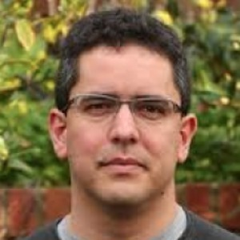

**[BOSC 2018](https://gccbosc2018.sched.com/) was held June 26-27,
2018** (with training days June 24-25 and a CollaborationFest June
28-29) at Reed College in Portland, Oregon as part of [the GCCBOSC 2018
bioinformatics community conference](https://gccbosc2018.sched.com/)
co-hosted with the Galaxy Community Conference. Check out the [complete
schedule](https://gccbosc2018.sched.com/)!'''

We thank GCC co-chairs Dave Clements and Nicole Vasilevsky for all their
contributions to making GCCBOSC 2018 a success!

Read our [report about GCCBOSC
2018](https://f1000research.com/collections/BOSC?&selectedDomain=articles)
on
[F1000](https://f1000research.com/collections/BOSC?&selectedDomain=articles)!

Brad Chapman's summaries of the conference: [Day
1](https://github.com/chapmanb/bcbb/blob/master/posts/conferences/bosc2018_day1a.md),
[Day
2](https://github.com/chapmanb/bcbb/blob/master/posts/conferences/bosc2018_day2.md)

14-November-2018: Videos from GCCBOSC 2018 are now available on
[YouTube](https://www.youtube.com/playlist?list=PLir-OOQiOhXaHvCY_KYshsOMULuXDqvh7)
and [Vimeo](https://vimeo.com/channels/gccbosc2018), and also linked
from the individual events on the [GCCBOSC
program](https://gccbosc2018.sched.com/).

<b>[BOSC 2019](https://www.open-bio.org/wiki/BOSC_2019) will be held
with [ISMB/ECCB 2019](https://www.iscb.org/ismbeccb2019) in Basel,
Switzerland, 21-25 July 2019.</b> BOSC will be the last two days of the
conference (24-25 July), followed by CollaborationFest.

## Important Dates

- March 19, 2018: Deadline for submitting abstracts for full talks
- **June 25-30, 2018: \[<https://gccbosc2018.sched.com/>\| GCCBOSC2018
  (Portland, Oregon)\]** -- main conference June 27-28
- June 25-26: GCCBOSC Training Days
- June 27-28: GCCBOSC main conference
- June 29,30, July 1,2: Collaborative coding at GCCBOSC

## Keynote Speakers

The [BOSC keynote
speakers](https://gccbosc2018.sched.com/directory/speakers) will be
[Fernando Pérez](https://gccbosc2018.sched.com/speaker/fperez10)
(Berkeley Institute for Data Science, University of California Berkeley)
and [Tracy K. Teal](https://gccbosc2018.sched.com/speaker/tkteal) (The
Carpentries). Additionally, GCC's keynote speaker is [Lucia
Peixoto](https://gccbosc2018.sched.com/speaker/lucia.peixoto).

## Why is BOSC partnering with GCC in 2018?

 BOSC has been a part of
[ISMB](https://www.iscb.org/ismb2018) since its inception, and we
greatly value our relationships with the ISCB management and the ISMB
community. [BOSC 2017](BOSC_2017 "wikilink"), which was part of
[ISMB/ECCB 2017](https://www.iscb.org/ismbeccb2017) in Prague, was an
exciting and successful meeting.

Because of our continuing focus on [broadening and deepening the BOSC
community](https://github.com/OBF/obf-docs/blob/master/Travel_fellowships.md),
we've been exploring ways to reach those in the bioinformatics community
who aren’t already part of the audience attracted by ISMB. As part of
that exploration, we have looked at other organizations and conferences
that have been successful at establishing a strong and growing community
of participants. One such conference is the [Galaxy Community Conference
(GCC)](https://gcc2017.sciencesconf.org/).

After much discussion and planning, we'll be participating in a
[bioinformatics community conference](https://gccbosc2018.sched.com/) in
2018 that includes both GCC and BOSC. We hope this will help serve the
open bioinformatics community in a few ways:

- It creates a conference with an explicit focus on development, support
  and maintenance of the interoperable software tools and libraries that
  enable modern scientific research. We believe the only sustainable way
  to provide the infrastructure needed for high throughput analyses is
  to build cooperating, open, diverse communities of programmers and
  biologists. This conference is where we hope to build and deepen this
  community.

<!-- -->

- It includes two dedicated training days by members from both the [Open
  Bioinformatics Foundation](https://www.open-bio.org/wiki/Main_Page)
  and Galaxy communities. This enables focused training on useful tools
  and approaches, making the conference attractive to anyone who wants
  to expand their skills.

<!-- -->

- There will be integrated collaboration days after the conference,
  merging [BOSC Codefest](https://www.open-bio.org/wiki/Codefest_2017)
  and [Galaxy's Developer and User Hackathon
  Days](https://gcc2017.sciencesconf.org/resource/page/id/10). We hope
  the integrated collaboration days following training and the
  conference talks will allow new and existing members of the community
  to attend and build working relationships.

<!-- -->

- The meeting will be held at a great venue in Portland--Reed
  College--providing an affordable and fun experience for anyone who
  wants to attend.

We would like to emphasize that this is an experiment for us and we
aren’t looking to sever our strong ties with ISMB. We're planning to
evaluate the combined GCC and BOSC experience in 2018 and welcome
community feedback on all of these thoughts and plans.

## Session Topics

BOSC covers all aspects of bioinformatics and open science software,
including (but not limited to):

- Open Science and Reproducible Research
- Open Biomedical Data
- Citizen/Participatory Science
- Standards and Interoperability
- Data Science
- Workflows
- Visualization
- Medical and Translational Bioinformatics
- Developer Tools and Libraries
- Bioinformatics Open Source Project Progress Reports

## BOSC Organizing Committee

**Chair**

- Nomi L. Harris (Lawrence Berkeley National Laboratory)

**Co-Chairs**

- Heather Wiencko ([Hosted Graphite](https://www.hostedgraphite.com),
  Dublin Ireland)
- [Brad Chapman](http://bcbio.wordpress.com) ([Biopython
  developer](http://biopython.org); [Harvard School of Public
  Health](http://compbio.sph.harvard.edu/chb/))--CoFest organizer

**Organizing Committee Members**

- [Peter Cock](http://www.scri.ac.uk/staff/petercock) ([Biopython
  developer](http://biopython.org); [James Hutton
  Institute](http://www.hutton.ac.uk))
- Christopher Fields (National Center for Supercomputing Applications)
- Karsten Hokamp (Smurfit Institute of Genetics, Trinity College Dublin,
  Ireland)
- [Hilmar Lapp](http://www.bioperl.org/wiki/Hilmar_Lapp) (Center for
  Genomic and Computational Biology (GCB), Duke University)
- Bastian Greshake Tzovaras ([Open Humans](https://www.openhumans.org/))

## Review Committee

Kai Blin\*, Christian Brueffer\*, Scott Cain, Brad Chapman\*, Peter
Cock\*, Anamaria Crisan, Gianluca Della Vedova, Christopher Fields\*,
Konrad Förstner\*, George Githinji, Bastian Greshake Tzovaras\*, Nomi
Harris\*, Michael Heuer, Karsten Hokamp\*, Shaun Jackman, Farah Khan\*,
Hilmar Lapp, Jessica Maia\*, Hervé Ménager, Frank Nothaft, Kieran
O'Neill, Konstantin Okonechnikov\*, Lorena Pantano\*, Surya Saha\*,
Malvika Sharan, Eric Talevich, Morgan Taschuk, Heather Wiencko\*, Jason
Williams, Yo Yehudi\*

(\* Also reviewed late-breaking abstracts)

## Previous BOSCs

- BOSC has been held yearly since 2000.
- [BOSC 2017](BOSC_2017 "wikilink") was held July 22-23, 2017 in Prague
  as part of the [ISMB/ECCB meeting](https://www.iscb.org/ismbeccb2017).
- [ Information about the first 17 BOSC
  conferences](Past_BOSC_conferences "wikilink")

## Code of Conduct

The GCCBOSC 2018 Code of Conduct can be found
[here](https://galaxyproject.org/events/gccbosc2018/code-of-conduct/).

## Contact Us

- [Follow BOSC on Twitter](https://twitter.com/OBF_BOSC): @OBF_BOSC,
  \#gccbosc
- If you'd like to join the mailing list for BOSC-related announcements,
  including the call for abstracts and deadline reminders, please
  subscribe to
  [bosc-announce](http://lists.open-bio.org/mailman/listinfo/bosc-announce).
  This list has low traffic, and your address will be kept private.
- If you have questions about the conference, or would like to volunteer
  to help out, please contact the organizers at
  <obf-bosc@googlegroups.com>.
