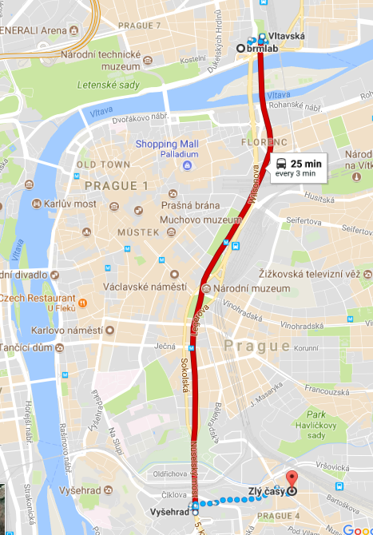

OpenBio Codefest 2017 is July 20th and 21st, 2017 (the Thursday and
Friday before [BOSC 2017](BOSC_2017 "wikilink") and the ISMB/ECCB 2017
meeting) at [Brmlab: a non-profit, community-run hackerspace in
Prague](https://brmlab.cz/).

This is an opportunity for anyone interested in open science, biology
and programming to meet, discuss and work collaboratively. Everyone is
welcome to attend. We will have a mix of experienced developers,
newcomers to bioinformatics and everything in between.

This is the 8th annual pre-[BOSC](BOSC "wikilink")
[Codefest](Codefest "wikilink"). Previous fun and successful events were
[Codefest 2010](Codefest_2010 "wikilink") in Boston, [Codefest
2011](Codefest_2011 "wikilink") in Vienna, [Codefest
2012](Codefest_2012 "wikilink") in Los Angeles, [Codefest
2013](Codefest_2013 "wikilink") in Berlin, and [Codefest
2014](Codefest_2014 "wikilink") in Boston, [Codefest
2015](Codefest_2015 "wikilink") in Dublin and [Codefest
2016](Codefest_2016 "wikilink") in Orlando.

## Objectives

The goal of Codefest is to bring open source bioinformatics programmers
together to have an enjoyable and productive two days. Practically this
results in a number of useful outcomes:

- Improving and expanding existing open source code, documentation and
  infrastructure (see the summaries from [Codefest
  2016](https://www.open-bio.org/wiki/Codefest_2016#Outcomes), [Codefest
  2015](https://www.open-bio.org/wiki/Codefest_2015#Outcomes), [Codefest
  2014](https://docs.google.com/presentation/d/114yvrK0Veasc_ns_rg484j2xxRi1h7wNlU2XKONuUqY/edit)
  and [Codefest
  2013](http://bcb.io/2013/07/18/summary-from-bioinformatics-open-science-codefest-2013-tools-infrastructure-standards-and-visualization/)
  for examples of work accomplished in previous years).

<!-- -->

- Developing new communities working on shared problems. For example,
  the [Common Workflow
  Language](https://groups.google.com/forum/#!forum/common-workflow-language)
  developed from discussions at Codefest 2014.

<!-- -->

- Establishing new friendships, helping to expand the open source
  bioinformatics community.

<!-- -->

- Preparing and publishing [papers about the work
  accomplished](http://www.biomedcentral.com/1471-2105/15/S14/S7).

## Outcomes

- [Summary slides for presentation at
  BOSC](https://docs.google.com/presentation/d/1f81Aj5-AzKrsRdMk8bvZqSrZ88bQVSMsQA9X4jZe0GE/edit?usp=sharing)
- [Google document of project and progress at
  Codefest](https://docs.google.com/document/d/1PHN1qAWq1a2zM91oPYBy0DP2KKq5MbT6mdEQpH_kjbQ/edit?usp=sharing)
- Photos: [Ntino's](https://photos.app.goo.gl/IgUcLp8pBlRApAxy1)

## Why attend

- For new members of the community: meet and learn with other open
  source programmers. There are [projects specifically for new
  attendees, or add your own
  ideas](https://docs.google.com/document/d/16OKzgx11VLLvvxzXlhDr8yPQ8gFYg61bfbes79qPJE8/edit?usp=sharing).

<!-- -->

- For current community members: expand your network and strengthen
  existing relationships. Teach and learn from new community members.
  Focus on open source work without interruptions. Discuss questions and
  problems in real time.

<!-- -->

- For everyone: discuss and learn from the community. Teach others what
  you know. Build new friendships and collaborations.

If you have any questions or thoughts, please get in touch with
[Brad](https://github.com/chapmanb) directly, in the [Gitter chat
room](https://gitter.im/chapmanb/obf-codefest) or on the [Codefest 2017
mailing
list](https://groups.google.com/forum/?fromgroups#!forum/openbio-codefest-2017).

## What to expect

The OpenBio Codefest is a collaborative two day working session. The
only requirement for attendance is that you have an interest in open
source software and solving scientific problems. We will have
contributors to open source bioinformatics tools present to
collaboratively work with, and we welcome new attendees who want to
learn and contribute to open source code or documentation.

The rough structure of the two days is:

- Start with introductions from everyone attending about their goals and
  plans for the two days.

<!-- -->

- Assemble into working groups based on shared interests like
  programming languages, open source projects or biological questions.
  We use the [collaboratively brainstormed Google
  document](https://docs.google.com/document/d/16OKzgx11VLLvvxzXlhDr8yPQ8gFYg61bfbes79qPJE8/edit?usp=sharing)
  as the basis for setting up groups. Attendees determine the goals for
  the two days. If you have an idea for a project, please add it before
  the event. Any and all suggestions are welcome.

<!-- -->

- Work and discuss. Enjoy the productive time.

<!-- -->

- We'll have regular breaks where each group can deliver short reports
  on their progress.

<!-- -->

- We have informal lunches, dinners and drinks as a way for everyone to
  get to know each other better.

<!-- -->

- At the end of the two days, we summarize contributions and work
  accomplished in a BOSC presentation and meeting report.

Please feel free to get in touch with any of the organizers with
questions. You are very welcome at Codefest.

## Attending

You are very welcome to attend. There is no cost, we only ask you to
register to help organize numbers. Please add yourself if you are
interested to [this Google
spreadsheet](https://docs.google.com/spreadsheets/d/1o-eIxURNdYoCsrpMRYtzXygM8wMj96WN8zYTTpLhkSU/edit#gid=0)
We'll coordinate through the [Codefest 2017 mailing
list](https://groups.google.com/forum/?fromgroups#!forum/openbio-codefest-2017),
so please sign up to discuss and receive updates.

If you're not able to physically attend, we're still more than happy to
have you participate in Codefest. Please sign up on the [the Google
spreadsheet](https://docs.google.com/spreadsheets/d/1o-eIxURNdYoCsrpMRYtzXygM8wMj96WN8zYTTpLhkSU/edit#gid=0)
and list yourself as remote only. We have a [Gitter chat
room](https://gitter.im/chapmanb/obf-codefest) we can use to coordinate
and discuss in real time and will have an open Google Hangout to make it
easier to be part of Codefest remotely.

Add your [project ideas to the shared google
document](https://docs.google.com/document/d/16OKzgx11VLLvvxzXlhDr8yPQ8gFYg61bfbes79qPJE8/edit?usp=sharing).
The ideas include smaller focused projects and larger work. We want
suggestions from everyone and will organize into groups around these
during Codefest.

## Logistics

Codefest is kindly hosted by [Brmlab](https://brmlab.cz/), a non-profit,
community-run hackerspace in Prague.

<table>
<tbody>
<tr class="odd">
<td><figure>

<figcaption>Brmlab</figcaption>
</figure></td>
</tr>
</tbody>
</table>

- [Brmlab's own directions](https://brmlab.cz/place)
- [Arrival
  tips](https://groups.google.com/forum/#!topic/openbio-codefest-2017/MliuaDBdo_o)
- [Google Map of Codefest/BOSC locations of interest in
  Prague](https://drive.google.com/open?id=1N9qWaOreNLstmAejjDQOhpKFZ0c&usp=sharing)

We plan to have lunch and coffee available for everyone attending. The
rough schedule for the two days is:

- Thursday July 20th 9am: Meet at Brmlab, introductions and organization
  into projects, coffee (from [Ouky Douky
  café](http://www.oukydouky.cz)), local fruits & pastries (from the
  [farmers' market](http://holesovickytrh.cz/))
- Thursday July 20th 10-1: Work in groups
- Thursday July 20th 1pm: Provided Lunch at Brmlab ([Pizza
  Letná](http://www.pizzaletna.cz/en/)\] + post-lunch presentations on
  progress and organization
- Thursday July 20th 2-6: Work in groups
- Thursday July 20th 6pm: End of day presentations
- Thursday July 20th 7pm: Pay-your-way group dinner in
  \[www.crossclub.cz/en Cross Club\]. SEE
  [DIRECTIONS](https://www.open-bio.org/wiki/Codefest_2017#Dinner)

<!-- -->

- Thursday July 20th late evening: Additional work at your discretion

<!-- -->

- Friday July 21st 9am: Meet at Brmlab, provide status updates and
  organize, coffee (from [Ouky Douky café](http://www.oukydouky.cz)),
  local fruits & pastries (from the [farmers'
  market](http://holesovickytrh.cz/))
- Friday July 21st 10-1: Work
- Friday July 21st 1pm: Provided lunch at Brmlab ([Pizza
  Letná](http://www.pizzaletna.cz/en/)) + post-lunch presentations on
  progress
- Friday July 21st 2-6: Work
- Friday July 21st 6pm: Wrap up presentations + clean-up of Brmlab, and
  get ready for [BOSC 2017](BOSC_2017 "wikilink")
- Friday July 21st 7.30pm: Pay-your-own-way group beer + optional pub
  food (not vegan) at [Zlý Časy](http://www.zlycasy.eu/). SEE
  [DIRECTIONS](https://www.open-bio.org/wiki/Codefest_2017#Beer)

This is completely flexible based on progress and needs of attendees.
Some resources while the hackathon is ongoing:

- [Google
  Hangout](https://hangouts.google.com/call/46cq2fdgbvhmjds4nybn4tipiay)
  for remote participants that will be on when we're working in Prague.
- Feel free to ask in the [Gitter Chat
  channel](https://gitter.im/chapmanb/obf-codefest) if you're wondering
  about the current status at any time.
- [Summary slides for presentation at
  BOSC](https://docs.google.com/presentation/d/1f81Aj5-AzKrsRdMk8bvZqSrZ88bQVSMsQA9X4jZe0GE/edit?usp=sharing)
- [Google document with documentation of on-going Codefest
  work](https://docs.google.com/document/d/1PHN1qAWq1a2zM91oPYBy0DP2KKq5MbT6mdEQpH_kjbQ/edit?usp=sharing)

## Dinner

On the first evening, **Thursday July 20th**, we're having a group
dinner in [Cross Club](http://www.crossclub.cz/en) at 7pm. Directions:

- Option one: [One stop with the
  underground](https://www.google.com/maps/dir/brmlab,+Bubensk%C3%A1+1477%2F1,+170+00+Praha+7-Hole%C5%A1ovice,+Czechia/Cross+Club+Kav%C3%A1rna,+Plyn%C3%A1rn%C3%AD+1096%2F23,+170+00+Praha+7-Hole%C5%A1ovice,+%C4%8Cesko/@50.1032505,14.4306477,15z/data=!3m1!4b1!4m14!4m13!1m5!1m1!1s0x470b94b80ce899d9:0xcc81f00a71b39b29!2m2!1d14.4359171!2d50.0984431!1m5!1m1!1s0x470b94b5151af143:0x2d943b3cb67afc96!2m2!1d14.4432531!2d50.1081792!3e3?hl=en)
  (alternatively a couple of stops with a tram, see [Google
  Maps](https://www.google.com/maps/dir/brmlab,+Bubensk%C3%A1+1477%2F1,+170+00+Praha+7-Hole%C5%A1ovice,+Czechia/Cross+Club+Kav%C3%A1rna,+Plyn%C3%A1rn%C3%AD+1096%2F23,+170+00+Praha+7-Hole%C5%A1ovice,+%C4%8Cesko/@50.1032505,14.4306477,15z/data=!3m1!4b1!4m14!4m13!1m5!1m1!1s0x470b94b80ce899d9:0xcc81f00a71b39b29!2m2!1d14.4359171!2d50.0984431!1m5!1m1!1s0x470b94b5151af143:0x2d943b3cb67afc96!2m2!1d14.4432531!2d50.1081792!3e3?hl=en))

<!-- -->

- Option two: 20 minutes
  [walk](https://www.google.com/maps/dir/brmlab,+Bubensk%C3%A1+1477%2F1,+170+00+Praha+7-Hole%C5%A1ovice,+Czechia/Cross+Club+Kav%C3%A1rna,+Plyn%C3%A1rn%C3%AD+1096%2F23,+170+00+Praha+7-Hole%C5%A1ovice,+%C4%8Cesko/@50.1032505,14.4306477,15z/data=!3m1!4b1!4m14!4m13!1m5!1m1!1s0x470b94b80ce899d9:0xcc81f00a71b39b29!2m2!1d14.4359171!2d50.0984431!1m5!1m1!1s0x470b94b5151af143:0x2d943b3cb67afc96!2m2!1d14.4432531!2d50.1081792!3e2?hl=en)

Please try to be there before 7.30pm, otherwise we'll loose our table
reservations.

## Beer

On the second evening, **Friday July 21st,** we're having a group beer
at [Zlý Časy](http://zlycasy.eu) at **7.30pm**. They have some
traditional pub food, too (no vegan and no gastro but authentic). The
vegetarian options are various cheese dishes. The vegan option is eating
elsewhere beforehand or afterwards.

It's a walking distance from the red C line, exactly from the **stop at
the congress center (Vyšehrad)**. Coming from the ISMB/ECCB
keynote\|registration\|reception is thus very possible!
[Directions:](https://www.google.com/maps/dir/brmlab,+Bubenská,+Holešovice,+Praha-Praha+7,+Česko/Zlý+Časy,+Čestmírova,+Praha,+Česko/@50.0816251,14.4333811,14z/data=!4m16!4m15!1m5!1m1!1s0x470b94b80ce899d9:0xcc81f00a71b39b29!2m2!1d14.4359171!2d50.0984431!1m5!1m1!1s0x470b947e932889db:0xe7fd48b92656f255!2m2!1d14.4420491!2d50.0643445!2m1!5e1!3e3?hl=en)

<table>
<tbody>
<tr class="odd">
<td>
  
</td>
<td><figure>

<figcaption>Brmlab to Zlý Časy (optionally via ISMB)</figcaption>
</figure></td>
<td>
  
</td>
</tr>
</tbody>
</table>

## Sponsors

<table>
<tbody>
<tr class="odd">
<td><figure>

<figcaption>Repositive Limited logo</figcaption>
</figure></td>
<td>
   
</td>
<td><figure>

<figcaption>Seven Bridges</figcaption>
</figure></td>
</tr>
</tbody>
</table>

We are grateful to and welcome [Repositive
Limited](https://repositive.io/) (connecting the genomics community with
the data they need) and [Seven Bridges](https://www.sevenbridges.com/)
(the Biomedical Data Analysis Platform) as new sponsors for the Codefest
and BOSC 2017. We thank the gorgeous [Brmlab](https://brmlab.cz) and its
members for providing us their great space, equipment, and help. We also
thank the [Institute of Organic Chemistry and
Biochemistry](http://www.uochb.cz/web/structure/31.html) for lending us
additional equipment.

We're looking for sponsors interested in being involved with the open
source community. Sponsorship money helps provide food and drink for the
Codefest and [Open Bioinformatics Foundation Travel
Fellowships](https://github.com/OBF/obf-docs/blob/master/Travel_fellowships.md)
for BOSC and Codefest. If interested, please get in touch with
[Brad](https://github.com/chapmanb) (Codefest) or the [BOSC
committee](mailto:bosc@open-bio.org) (general).

## Organizers

- [Brad Chapman](http://github.com/chapmanb)
- [Matúš Kalaš](https://twitter.com/matuskalas)
- [Heather Wiencko](https://twitter.com/HLWiencko)
